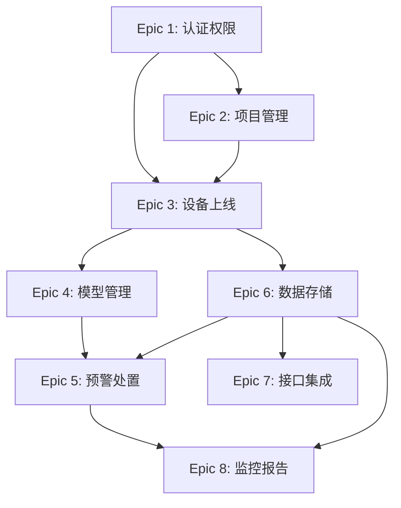

# 生命线AI感知云平台 - Epic Breakdown

## Overview

This document provides the complete epic and story breakdown for 生命线AI感知云平台, decomposing the requirements from the PRD, UX Design if it exists, and Architecture requirements into implementable stories.

## Requirements Inventory

### Functional Requirements

**项目管理 (Project Management)**
- FR1: 运维人员可以创建新项目并设置项目基本信息
- FR2: 运维人员可以查看项目下的设备列表和状态概览
- FR3: 管理员可以编辑项目配置信息
- FR4: 运维人员可以按项目维度组织和管理设备
- FR5: 管理员可以配置项目级别的数据隔离规则

**设备管理 (Device Management)**
- FR6: 运维人员可以通过扫描二维码快速注册新设备
- FR7: 运维人员可以手动录入第三方设备信息
- FR8: 运维人员可以查看设备实时状态（在线/离线/故障）
- FR9: 运维人员可以查看设备详细信息和配置参数
- FR10: 运维人员可以远程修改设备采集频次、上传频次等配置
- FR11: 运维人员可以远程修改设备报警阈值
- FR12: 运维人员可以批量对多台设备执行相同配置操作
- FR13: 运维人员可以查看设备历史状态变更记录
- FR14: 管理员可以触发设备固件OTA升级
- FR15: 管理员可以查看设备固件版本信息

**模型管理 (Model Management)**
- FR16: 运维人员可以查看可用的AI模型列表及模型说明
- FR17: 运维人员可以将AI模型绑定到指定设备
- FR18: 运维人员可以解除设备与AI模型的绑定关系
- FR19: 运维人员可以查看设备绑定的模型运行状态
- FR20: 运维人员可以查看AI分析结果（错混接、淤堵、溢流、满管分析）
- FR21: 运维人员可以查看AI分析的置信度
- FR22: 管理员可以从云端向边缘设备下发更新的AI模型
- FR23: 运维人员可以查看模型分析的历史记录

**预警管理 (Alert Management)**
- FR24: 运维人员可以在预警看板查看当前所有预警信息
- FR25: 运维人员可以查看预警详情（设备信息、时间、分析结论、置信度）
- FR26: 运维人员可以查看预警关联的历史数据曲线
- FR27: 运维人员可以对预警进行确认、处置、关闭操作
- FR28: 运维人员可以为预警生成处置工单
- FR29: 系统可以自动向相关人员推送预警通知
- FR30: 运维人员可以按预警类型、时间、设备筛选预警记录
- FR31: 运维人员可以查看预警处置闭环状态

**接口管理 (Interface Management)**
- FR32: IT对接工程师可以查看完整的API接口文档
- FR33: IT对接工程师可以自助申请API访问密钥
- FR34: IT对接工程师可以设置API密钥的有效期和权限范围
- FR35: IT对接工程师可以通过RESTful API查询设备状态数据
- FR36: IT对接工程师可以通过RESTful API查询AI分析结果
- FR37: IT对接工程师可以通过RESTful API查询历史监测数据
- FR38: IT对接工程师可以配置Webhook接收预警事件推送
- FR39: IT对接工程师可以测试Webhook连通性
- FR40: 管理员可以查看API调用日志和统计

**数据存储与查询 (Data Storage & Query)**
- FR41: 系统可以存储设备上报的时序监测数据（保留≥2个月）
- FR42: 运维人员可以查询设备的历史监测数据
- FR43: 运维人员可以按时间范围筛选历史数据
- FR44: 系统可以自动备份监测数据
- FR45: 系统可以将超过2年的历史数据归档到冷存储

**用户与权限管理 (User & Permission Management)**
- FR46: 管理员可以创建新用户账号
- FR47: 管理员可以为用户分配角色（管理员/运维员/观察员）
- FR48: 管理员可以禁用或删除用户账号
- FR49: 用户可以使用账号密码登录系统
- FR50: 管理员可以查看用户操作审计日志
- FR51: 系统可以根据用户角色限制功能访问权限

**系统监控与报告 (System Monitoring & Reporting)**
- FR52: 运维人员可以查看项目概览看板（设备在线率、预警统计、关键指标）
- FR53: 项目管理人员可以查看预警类型分布统计
- FR54: 项目管理人员可以查看预警处置效率统计
- FR55: 项目管理人员可以一键生成运营报告（日报/周报/月报）
- FR56: 项目管理人员可以导出报告为PDF格式
- FR57: 管理员可以查看系统运行状态和资源使用情况

### NonFunctional Requirements

**性能 (Performance)**
- NFR-P01: 边缘AI推理延迟 ≤100ms
- NFR-P02: 设备上线完整流程 ≤10分钟
- NFR-P03: 云端API响应时间 (P95) ≤500ms
- NFR-P04: 历史数据查询响应 ≤3秒
- NFR-P05: 预警推送延迟 ≤5秒
- NFR-P06: 并发设备上报 ≥1000设备/分钟
- NFR-P07: 页面首屏加载 ≤2秒

**安全 (Security)**
- NFR-S01: 数据传输加密 HTTPS/TLS 1.3
- NFR-S02: 敏感数据存储加密 AES-256
- NFR-S03: 用户认证 账号密码 + 会话管理
- NFR-S04: 访问控制 三级RBAC权限模型
- NFR-S05: 操作审计日志 保留≥6个月
- NFR-S06: 数据脱敏 对外接口敏感字段脱敏
- NFR-S07: 设备身份认证 设备证书/密钥
- NFR-S08: 固件安全升级 签名验证
- NFR-S09: 等保认证 第1年内完成

**可靠性 (Reliability)**
- NFR-R01: 云端平台可用性 ≥99.5%
- NFR-R02: 设备在线率 ≥95%
- NFR-R03: 数据备份 每日增量 + 每周全量
- NFR-R04: 灾难恢复RTO ≤4小时
- NFR-R05: 灾难恢复RPO ≤1小时
- NFR-R06: 边缘离线运行 支持
- NFR-R07: 单点故障影响 ≤10%设备

**可扩展性 (Scalability)**
- NFR-SC01: MVP设备接入 389套
- NFR-SC02: 第3年设备接入 ≥5000套
- NFR-SC03: 新专项扩展 ≤3个月
- NFR-SC04: 新设备类型接入 ≤2周
- NFR-SC05: 性能退化容忍 <10%

**集成 (Integration)**
- NFR-I01: 设备通信协议 4G/5G, NB-IoT, LoRa, RS485/Modbus, MQTT
- NFR-I02: 数据开放接口 RESTful API
- NFR-I03: 事件推送 Webhook
- NFR-I04: 第三方系统对接 市政大数据平台、应急指挥系统
- NFR-I05: 信创环境适配 麒麟/统信UOS、达梦/人大金仓、鲲鹏/飞腾

**数据管理 (Data Management)**
- NFR-D01: 时序数据存储 ≥2个月
- NFR-D02: 历史数据归档 ≥2年
- NFR-D03: 数据本地化 必须
- NFR-D04: AI模型大小 ≤100MB

### Additional Requirements (From Architecture)

**技术栈要求：**
- 前端框架：Vue Vben Admin 5.x + Ant Design Vue 4.x
- 后端框架：NestJS 10.x + TypeORM 0.3.x
- 关系数据库：PostgreSQL 15+
- 时序数据库：ClickHouse 23+ (分区键: toYYYYMMDD, TTL: 60天)
- 缓存：Redis 7+ + ioredis 5.x
- MQTT Broker：EMQX 5.x
- 容器化：Docker + Kubernetes
- CI/CD：GitLab CI
- 云服务商：华为云

**认证授权：**
- 认证方案：JWT + Refresh Token
- 权限框架：CASL
- API认证：HMAC-SHA256签名
- API Key格式：`lk_live_xxx`

**命名约定：**
- 数据库：snake_case (表名复数)
- API：kebab-case路径, camelCase参数
- 代码：PascalCase类, camelCase函数

**API响应格式：**
```json
{
  "code": 0,
  "message": "success",
  "data": {},
  "timestamp": "ISO8601"
}
```

### UX Design Requirements

**核心体验：**
- UX-DR1: 扫码即用，10分钟设备上线（核心差异化）
- UX-DR2: 预警实时推送，WebSocket + 声音提醒
- UX-DR3: 一屏掌握全局态势（仪表盘 + 预警看板）

**设计系统：**
- UX-DR4: Vue Vben Admin 5.x + Ant Design Vue 4.x
- UX-DR5: 图表库 ECharts 5.x
- UX-DR6: 地图组件 天地图（政府合规）
- UX-DR7: 主题色 #0050b3 (政府蓝)

**定制组件：**
- UX-DR8: DeviceCard 设备卡片（状态、位置、最新数据）
- UX-DR9: AlertCard 预警卡片（级别、时间、处理状态）
- UX-DR10: AlertSummaryCard 预警统计卡片（4级预警数量）
- UX-DR11: DeviceStatusCard 设备状态卡片（在线/离线/告警）
- UX-DR12: AlertLevelTag 预警级别标签（红/橙/黄/蓝）
- UX-DR13: DeviceStatusBadge 设备状态徽章
- UX-DR14: TelemetryChart 遥测数据图表

**预警分级色：**
- UX-DR15: 特别严重 红色 #ff4d4f
- UX-DR16: 严重 橙色 #fa8c16
- UX-DR17: 较重 黄色 #fadb14
- UX-DR18: 一般 蓝色 #1890ff

**用户旅程：**
- UX-DR19: 设备快速上线（扫码→激活→确认，3步完成）
- UX-DR20: 实时预警处理（推送→详情→处理→关闭）
- UX-DR21: 预警规则配置（选择指标→设置阈值→配置通知）
- UX-DR22: 数据报告查看（选择类型→设置时间→生成→导出）

### FR Coverage Map

| FR | Epic | 简要描述 |
|----|------|----------|
| FR1 | Epic 2 | 创建新项目 |
| FR2 | Epic 2 | 查看项目设备列表 |
| FR3 | Epic 2 | 编辑项目配置 |
| FR4 | Epic 2 | 按项目组织设备 |
| FR5 | Epic 2 | 项目数据隔离 |
| FR6 | Epic 3 | 扫码注册设备 |
| FR7 | Epic 3 | 手动录入第三方设备 |
| FR8 | Epic 3 | 查看设备实时状态 |
| FR9 | Epic 3 | 查看设备详情 |
| FR10 | Epic 3 | 远程修改采集配置 |
| FR11 | Epic 3 | 远程修改报警阈值 |
| FR12 | Epic 3 | 批量配置操作 |
| FR13 | Epic 3 | 设备历史状态记录 |
| FR14 | Epic 3 | OTA固件升级 |
| FR15 | Epic 3 | 查看固件版本 |
| FR16 | Epic 4 | 查看AI模型列表 |
| FR17 | Epic 4 | 模型绑定设备 |
| FR18 | Epic 4 | 解除模型绑定 |
| FR19 | Epic 4 | 查看模型运行状态 |
| FR20 | Epic 4 | 查看AI分析结果 |
| FR21 | Epic 4 | 查看分析置信度 |
| FR22 | Epic 4 | 云端下发模型 |
| FR23 | Epic 4 | 查看分析历史 |
| FR24 | Epic 5 | 预警看板 |
| FR25 | Epic 5 | 预警详情 |
| FR26 | Epic 5 | 预警历史数据曲线 |
| FR27 | Epic 5 | 预警确认/处置/关闭 |
| FR28 | Epic 5 | 生成处置工单 |
| FR29 | Epic 5 | 预警推送通知 |
| FR30 | Epic 5 | 预警筛选 |
| FR31 | Epic 5 | 处置闭环状态 |
| FR32 | Epic 7 | API接口文档 |
| FR33 | Epic 7 | 申请API密钥 |
| FR34 | Epic 7 | 设置密钥权限 |
| FR35 | Epic 7 | API查询设备状态 |
| FR36 | Epic 7 | API查询AI结果 |
| FR37 | Epic 7 | API查询历史数据 |
| FR38 | Epic 7 | 配置Webhook |
| FR39 | Epic 7 | 测试Webhook |
| FR40 | Epic 7 | API调用日志 |
| FR41 | Epic 6 | 时序数据存储 |
| FR42 | Epic 6 | 查询历史数据 |
| FR43 | Epic 6 | 按时间筛选 |
| FR44 | Epic 6 | 自动备份 |
| FR45 | Epic 6 | 历史数据归档 |
| FR46 | Epic 1 | 创建用户账号 |
| FR47 | Epic 1 | 分配用户角色 |
| FR48 | Epic 1 | 禁用/删除用户 |
| FR49 | Epic 1 | 账号密码登录 |
| FR50 | Epic 1 | 操作审计日志 |
| FR51 | Epic 1 | 角色权限控制 |
| FR52 | Epic 8 | 项目概览看板 |
| FR53 | Epic 8 | 预警类型统计 |
| FR54 | Epic 8 | 处置效率统计 |
| FR55 | Epic 8 | 生成运营报告 |
| FR56 | Epic 8 | 导出PDF报告 |
| FR57 | Epic 8 | 系统运行状态 |

**覆盖率: 57/57 = 100%** ✅

---

## Epic List

### Epic 1: 用户认证与权限管理

**Epic目标：** 用户可以注册账号、登录系统，管理员可以管理用户和分配角色权限，系统具备完整的安全认证基础，为所有后续Epic提供身份验证和授权能力。

**用户价值：** 安全登录、角色权限控制、审计追溯

**FRs covered:** FR46, FR47, FR48, FR49, FR50, FR51

**依赖关系：** 无前置依赖（基础Epic）

**预估Story数：** ~12

**技术要点：**
- JWT + Refresh Token认证
- CASL权限框架
- 三级RBAC（管理员/运维员/观察员）
- 审计日志存储（PostgreSQL）

---

#### Epic 1 Stories

### Story 1.1: 项目初始化与基础框架搭建

**As a** 开发团队,
**I want** 初始化前后端项目框架,
**So that** 后续所有功能开发都有统一的技术基础.

**Acceptance Criteria:**

- **Given** 开发环境已准备就绪
- **When** 执行项目初始化脚本
- **Then** 后端NestJS项目创建成功，包含TypeORM、配置模块、日志模块
- **And** 前端Vue Vben Admin项目创建成功，包含路由、状态管理、API层
- **And** 数据库连接配置完成（PostgreSQL、Redis）
- **And** 项目可以通过`pnpm dev`启动并访问

**技术要点:**
- 后端: `nest new api`, 安装@nestjs/typeorm, @nestjs/config, ioredis
- 前端: `pnpm create vben`, 配置API代理
- 创建: `users`, `roles`, `permissions` 表结构
- 配置: `.env` 环境变量模板

**FR covered:** 基础设施（所有FR的前置）

**NFR covered:** NFR-I05（信创适配基础）

---

### Story 1.2: 用户注册与账号创建

**As a** 管理员,
**I want** 创建新的用户账号,
**So that** 新员工可以访问系统完成工作任务.

**Acceptance Criteria:**

- **Given** 管理员已登录系统
- **When** 管理员在用户管理页面点击"新增用户"，填写用户信息（用户名、密码、姓名、邮箱、手机号）
- **Then** 系统验证用户名唯一性
- **And** 系统使用bcrypt加密密码（cost factor: 10）
- **And** 系统创建用户记录，默认状态为"待激活"
- **And** 系统发送激活邮件到用户邮箱（可选功能）

**技术要点:**
- 调用API: `POST /api/v1/users`
- 密码加密: `bcrypt.hash(password, 10)`
- 数据表: `users` (id, username, password_hash, name, email, phone, status, created_at)
- 状态枚举: `PENDING | ACTIVE | DISABLED`

**FR covered:** FR46

**NFR covered:** NFR-S02（密码加密存储）

---

### Story 1.3: 用户登录认证

**As a** 用户,
**I want** 使用账号密码登录系统,
**So that** 安全地访问系统功能.

**Acceptance Criteria:**

- **Given** 用户已有激活状态的账号
- **When** 用户在登录页面输入用户名和密码，点击"登录"
- **Then** 系统验证用户名密码正确性
- **And** 系统生成JWT Access Token（有效期15分钟）和Refresh Token（有效期7天）
- **And** 系统返回Token并存储到前端（localStorage + 内存）
- **And** 登录成功后跳转到首页
- **And** 登录失败时显示明确的错误提示（用户名或密码错误）

**技术要点:**
- 调用API: `POST /api/v1/auth/login`
- JWT Payload: `{ sub: userId, username, role }`
- Token格式: `Authorization: Bearer {access_token}`
- Refresh Token存储: Redis（key: `refresh:{userId}:{tokenId}`）
- 登录失败记录: `audit_logs` 表

**FR covered:** FR49

**NFR covered:** NFR-S01（HTTPS传输）、NFR-S03（会话管理）

---

### Story 1.4: Token刷新与登出

**As a** 用户,
**I want** 刷新Token或登出系统,
**So that** 保持会话连续性或安全退出系统.

**Acceptance Criteria:**

- **Given** 用户已登录系统，Access Token即将过期
- **When** 前端检测到Token即将过期（剩余<2分钟）
- **Then** 系统自动使用Refresh Token获取新的Access Token
- **And** 刷新成功后无感知继续使用

- **Given** 用户已登录系统
- **When** 用户点击"退出登录"
- **Then** 系统撤销Refresh Token（从Redis删除）
- **And** 清除前端存储的Token
- **And** 跳转到登录页面

**技术要点:**
- 刷新API: `POST /api/v1/auth/refresh`
- 登出API: `POST /api/v1/auth/logout`
- Redis操作: `DEL refresh:{userId}:{tokenId}`
- 前端拦截器: Axios 401自动刷新

**FR covered:** FR49（Token管理部分）

---

### Story 1.5: 角色定义与权限规则配置

**As a** 系统,
**I want** 定义三级角色及其权限规则,
**So that** 不同角色用户可以访问相应的功能.

**Acceptance Criteria:**

- **Given** 系统初始化完成
- **When** 系统启动时
- **Then** 系统预置三种角色：管理员、运维员、观察员
- **And** 每种角色对应明确的权限规则（CASL定义）
- **And** 权限规则同时应用于前后端

**角色权限矩阵:**

| 功能模块 | 管理员 | 运维员 | 观察员 |
|----------|--------|--------|--------|
| 用户管理 | ✅ 全部 | ❌ | ❌ |
| 项目管理 | ✅ 全部 | ✅ 查看 | ✅ 查看 |
| 设备管理 | ✅ 全部 | ✅ 操作 | ✅ 查看 |
| 模型管理 | ✅ 全部 | ✅ 绑定 | ✅ 查看 |
| 预警管理 | ✅ 全部 | ✅ 处置 | ✅ 查看 |
| 系统设置 | ✅ 全部 | ❌ | ❌ |

**技术要点:**
- CASL定义: `ability.ts` (前后端共享)
- 数据表: `roles` (id, name, code, permissions JSON)
- 权限格式: `{ action: 'manage', subject: 'Device' }`
- API中间件: `@UseGuards(PermissionsGuard)`

**FR covered:** FR51

**NFR covered:** NFR-S04（三级RBAC）

---

### Story 1.6: 用户角色分配

**As a** 管理员,
**I want** 为用户分配角色,
**So that** 用户获得相应的操作权限.

**Acceptance Criteria:**

- **Given** 管理员在用户管理页面
- **When** 管理员选择某个用户，点击"分配角色"，选择角色（管理员/运维员/观察员）
- **Then** 系统更新用户的角色信息
- **And** 用户下次登录时生效新角色权限
- **And** 记录角色变更审计日志

**技术要点:**
- 调用API: `PUT /api/v1/users/{userId}/role`
- 数据表: `users.role_id` 外键关联
- 审计日志: `{ action: 'ASSIGN_ROLE', target: userId, newValue: 'operator' }`
- 禁止自己修改自己的角色

**FR covered:** FR47

---

### Story 1.7: 用户状态管理与账号禁用

**As a** 管理员,
**I want** 禁用或删除用户账号,
**So that** 控制用户对系统的访问权限.

**Acceptance Criteria:**

- **Given** 管理员在用户管理页面
- **When** 管理员选择某个用户，点击"禁用账号"
- **Then** 用户状态变更为"已禁用"
- **And** 该用户当前会话立即失效（Token撤销）
- **And** 该用户无法再登录系统

- **Given** 管理员需要删除用户
- **When** 管理员点击"删除用户"
- **Then** 系统软删除用户记录（设置deleted_at）
- **And** 保留审计日志中的操作记录

**技术要点:**
- 调用API: `PUT /api/v1/users/{userId}/status`
- 调用API: `DELETE /api/v1/users/{userId}` (软删除)
- Token撤销: `DEL refresh:{userId}:*` (Redis批量删除)
- 状态枚举: `ACTIVE | DISABLED | DELETED`

**FR covered:** FR48

---

### Story 1.8: 用户列表与查询

**As a** 管理员,
**I want** 查看用户列表并搜索用户,
**So that** 管理和查找系统用户.

**Acceptance Criteria:**

- **Given** 管理员进入用户管理页面
- **When** 页面加载
- **Then** 系统显示用户列表（用户名、姓名、角色、状态、创建时间）
- **And** 支持按用户名/姓名搜索
- **And** 支持按角色筛选
- **And** 支持按状态筛选
- **And** 支持分页显示（每页20条）

**技术要点:**
- 调用API: `GET /api/v1/users?page=1&pageSize=20&search={keyword}&role={role}&status={status}`
- 响应格式: `{ items: [], total, page, pageSize }`
- 排序: 按创建时间倒序

**FR covered:** FR46（查询部分）

---

### Story 1.9: 操作审计日志记录

**As a** 系统,
**I want** 自动记录用户操作审计日志,
**So that** 满足合规要求并支持追溯.

**Acceptance Criteria:**

- **Given** 用户执行任何操作
- **When** 操作发生时
- **Then** 系统自动记录审计日志（用户ID、操作类型、操作对象、操作时间、IP地址、操作结果）
- **And** 敏感操作（登录、权限变更、删除）必须记录
- **And** 审计日志不可修改和删除
- **And** 日志保留期限≥6个月

**技术要点:**
- 数据表: `audit_logs` (id, user_id, action, target_type, target_id, ip, user_agent, result, created_at)
- 分区键: `toYYYYMM(created_at)`
- 中间件: `AuditLogInterceptor` 自动拦截
- 敏感操作枚举: `LOGIN | LOGOUT | CREATE_USER | ASSIGN_ROLE | DISABLE_USER | DELETE_*`

**FR covered:** FR50

**NFR covered:** NFR-S05（审计日志保留≥6个月）

---

### Story 1.10: 审计日志查询

**As a** 管理员,
**I want** 查询用户操作审计日志,
**So that** 追溯用户操作行为和排查问题.

**Acceptance Criteria:**

- **Given** 管理员进入审计日志页面
- **When** 页面加载
- **Then** 系统显示审计日志列表（时间、用户、操作、对象、IP、结果）
- **And** 支持按时间范围筛选
- **And** 支持按用户筛选
- **And** 支持按操作类型筛选
- **And** 查询响应时间≤3秒
- **And** 支持导出日志（CSV格式）

**技术要点:**
- 调用API: `GET /api/v1/audit-logs?startTime={}&endTime={}&userId={}&action={}`
- 索引: `idx_audit_logs_user_id`, `idx_audit_logs_created_at`
- 导出API: `GET /api/v1/audit-logs/export`

**FR covered:** FR50

---

### Story 1.11: 前端路由权限控制

**As a** 系统,
**I want** 根据用户角色控制前端路由和菜单显示,
**So that** 用户只能看到有权限访问的功能.

**Acceptance Criteria:**

- **Given** 用户登录成功
- **When** 系统加载菜单和路由
- **Then** 系统根据用户角色过滤菜单项
- **And** 无权限的菜单不显示
- **And** 直接访问无权限页面时显示403提示
- **And** 菜单权限与后端API权限一致

**技术要点:**
- 路由meta: `{ meta: { permission: 'manage', subject: 'User' } }`
- 路由守卫: `router.beforeEach` 检查权限
- 菜单过滤: 基于CASL ability过滤
- 403页面: `views/error/403.vue`

**FR covered:** FR51

**UX-DR covered:** UX-DR4（Vue Vben Admin内置权限管理）

---

### Story 1.12: API权限守卫

**As a** 系统,
**I want** 在后端API层验证用户权限,
**So that** 确保无权限用户无法调用敏感接口.

**Acceptance Criteria:**

- **Given** 用户请求某个API
- **When** 请求到达后端
- **Then** 系统验证JWT Token有效性
- **And** 系统检查用户是否有该API的访问权限
- **And** 无权限时返回403错误
- **And** Token无效时返回401错误

**技术要点:**
- Guard: `@UseGuards(JwtAuthGuard, PermissionsGuard)`
- 装饰器: `@RequirePermissions('manage', 'User')`
- 异常: `ForbiddenException`, `UnauthorizedException`
- 全局配置: `APP_GUARD` 注册

**FR covered:** FR51

**NFR covered:** NFR-S04（访问控制）

---

#### Epic 1 Story Summary

| Story | 名称 | FR | 复杂度 |
|-------|------|-----|--------|
| 1.1 | 项目初始化与基础框架搭建 | 基础设施 | L |
| 1.2 | 用户注册与账号创建 | FR46 | M |
| 1.3 | 用户登录认证 | FR49 | M |
| 1.4 | Token刷新与登出 | FR49 | S |
| 1.5 | 角色定义与权限规则配置 | FR51 | M |
| 1.6 | 用户角色分配 | FR47 | S |
| 1.7 | 用户状态管理与账号禁用 | FR48 | M |
| 1.8 | 用户列表与查询 | FR46 | S |
| 1.9 | 操作审计日志记录 | FR50 | M |
| 1.10 | 审计日志查询 | FR50 | S |
| 1.11 | 前端路由权限控制 | FR51 | M |
| 1.12 | API权限守卫 | FR51 | M |
| **总计** | **12 Stories** | **FR46-FR51** | |

---

### Epic 2: 项目与设备组织管理

**Epic目标：** 用户可以创建项目、按项目组织设备，实现数据隔离和设备分组管理，为后续设备接入建立组织框架。

**用户价值：** 项目级数据隔离、设备分组管理

**FRs covered:** FR1, FR2, FR3, FR4, FR5

**依赖关系：** Epic 1（用户认证）

**预估Story数：** ~8

**技术要点：**
- 项目实体与TypeORM映射
- 项目-用户关联表
- 数据隔离中间件
- 项目配置CRUD

---

#### Epic 2 Stories

### Story 2.1: 项目实体与数据表创建

**As a** 开发团队,
**I want** 创建项目相关的数据表和实体,
**So that** 后续所有项目相关功能有数据存储基础.

**Acceptance Criteria:**

- **Given** 数据库已初始化完成
- **When** 执行数据库迁移
- **Then** 系统创建`projects`表（id, name, code, description, settings JSON, status, created_at, updated_at）
- **And** 创建`project_users`关联表（project_id, user_id, role）
- **And** 创建相关索引（idx_projects_code, idx_projects_status）
- **And** TypeORM实体定义完成

**技术要点:**
- 数据表: `projects`, `project_users`
- Entity: `project.entity.ts`
- 索引: `code`唯一索引, `status`普通索引
- 外键: `project_users.project_id → projects.id`

**FR covered:** 基础设施（FR1-5的前置）

---

### Story 2.2: 项目创建

**As a** 运维人员,
**I want** 创建新项目并设置基本信息,
**So that** 为设备组织和管理建立项目框架.

**Acceptance Criteria:**

- **Given** 运维人员已登录系统
- **When** 运维人员在项目列表页面点击"新建项目"，填写项目信息（项目名称、项目编码、描述）
- **Then** 系统验证项目编码唯一性（全局唯一）
- **And** 系统创建项目记录，状态为"活跃"
- **And** 创建者自动成为项目管理员（关联记录写入project_users）
- **And** 返回项目详情页面

**技术要点:**
- 调用API: `POST /api/v1/projects`
- 请求体: `{ name, code, description }`
- 数据表: `projects`, `project_users`
- 项目编码格式: 大写字母+数字，3-20字符
- 审计日志: 记录项目创建操作

**FR covered:** FR1

---

### Story 2.3: 项目列表与查询

**As a** 运维人员,
**I want** 查看项目列表并搜索项目,
**So that** 快速找到需要管理的项目.

**Acceptance Criteria:**

- **Given** 运维人员进入项目列表页面
- **When** 页面加载
- **Then** 系统显示用户有权限访问的项目列表（项目名称、编码、设备数量、状态、创建时间）
- **And** 支持按项目名称/编码搜索
- **And** 支持按状态筛选（活跃/归档）
- **And** 支持分页显示（每页20条）
- **And** 运维员只看到自己参与的项目，管理员看到所有项目

**技术要点:**
- 调用API: `GET /api/v1/projects?page=1&pageSize=20&search={keyword}&status={status}`
- 权限过滤: 基于project_users关联表
- 响应格式: `{ items: [], total, page, pageSize }`
- 设备数量: 聚合查询`COUNT(*) FROM devices WHERE project_id = ?`

**FR covered:** FR1（查询部分）

---

### Story 2.4: 项目详情与设备概览

**As a** 运维人员,
**I want** 查看项目详情和设备状态概览,
**So that** 了解项目整体运行情况.

**Acceptance Criteria:**

- **Given** 运维人员在项目列表中点击某个项目
- **When** 进入项目详情页面
- **Then** 系统显示项目基本信息（名称、编码、描述、创建时间）
- **And** 系统显示设备统计卡片（总设备数、在线数、离线数、告警数）
- **And** 系统显示最近5条设备状态变化记录
- **And** 系统显示最近5条预警记录

**技术要点:**
- 调用API: `GET /api/v1/projects/{projectId}`
- 调用API: `GET /api/v1/projects/{projectId}/overview`
- 响应格式: `{ project: {}, stats: { total, online, offline, alert }, recentActivities: [] }`
- 统计查询: Redis缓存5分钟

**FR covered:** FR2

---

### Story 2.5: 项目配置编辑

**As a** 管理员,
**I want** 编辑项目配置信息,
**So that** 更新项目的基本信息和设置.

**Acceptance Criteria:**

- **Given** 管理员在项目详情页面
- **When** 管理员点击"编辑项目"，修改项目信息（名称、描述、其他配置）
- **Then** 系统验证必填字段完整性
- **And** 系统更新项目记录
- **And** 记录配置变更审计日志
- **And** 项目编码不可修改（创建后锁定）

**技术要点:**
- 调用API: `PUT /api/v1/projects/{projectId}`
- 请求体: `{ name, description, settings: {} }`
- 禁止修改: `code` 字段
- 审计日志: `{ action: 'UPDATE_PROJECT', changes: {...} }`

**FR covered:** FR3

---

### Story 2.6: 项目成员管理

**As a** 管理员,
**I want** 为项目添加或移除成员,
**So that** 控制哪些用户可以访问该项目的数据.

**Acceptance Criteria:**

- **Given** 管理员在项目详情页面
- **When** 管理员点击"成员管理"
- **Then** 系统显示当前项目成员列表（用户名、姓名、角色、加入时间）
- **And** 支持添加新成员（选择用户、分配项目角色）
- **And** 支持移除成员（从project_users删除关联）
- **And** 支持修改成员的项目角色

**技术要点:**
- 调用API: `GET /api/v1/projects/{projectId}/members`
- 调用API: `POST /api/v1/projects/{projectId}/members`
- 调用API: `DELETE /api/v1/projects/{projectId}/members/{userId}`
- 调用API: `PUT /api/v1/projects/{projectId}/members/{userId}/role`
- 项目角色: `owner | admin | operator | viewer`
- 审计日志: 记录成员变更

**FR covered:** FR4（成员组织部分）

---

### Story 2.7: 设备按项目组织与分配

**As a** 运维人员,
**I want** 将设备分配到指定项目,
**So that** 按项目维度组织和管理设备.

**Acceptance Criteria:**

- **Given** 运维人员在设备详情页面或批量操作页面
- **When** 运维人员选择设备，点击"分配项目"，选择目标项目
- **Then** 系统更新设备的project_id字段
- **And** 设备数据（遥测、预警）自动归属到新项目
- **And** 记录设备项目变更历史

**技术要点:**
- 调用API: `PUT /api/v1/devices/{deviceId}/project`
- 调用API: `POST /api/v1/devices/batch-assign-project`
- 数据表: `devices.project_id`
- 变更历史: `device_project_history` 表
- 权限检查: 用户必须是目标项目成员

**FR covered:** FR4

---

### Story 2.8: 项目级数据隔离中间件

**As a** 系统,
**I want** 自动按项目隔离数据访问,
**So that** 用户只能看到自己有权限的项目数据.

**Acceptance Criteria:**

- **Given** 用户请求任何业务数据API
- **When** 请求经过数据隔离中间件
- **Then** 系统自动添加项目过滤条件（WHERE project_id IN (用户可访问的项目)）
- **And** 管理员可以看到所有项目数据
- **And** 运维员/观察员只能看到自己参与的项目数据
- **And** 跨项目访问返回403错误

**技术要点:**
- 中间件: `ProjectIsolationMiddleware`
- TypeORM监听器: `@BeforeFind()` 自动注入条件
- 权限缓存: Redis `user:{userId}:projects` 缓存5分钟
- 排除接口: `/api/v1/auth/*`, `/api/v1/users/*` (管理员专用)

**FR covered:** FR5

---

### Story 2.9: 项目归档与恢复

**As a** 管理员,
**I want** 归档不再使用的项目或恢复已归档的项目,
**So that** 保持项目列表整洁同时保留历史数据.

**Acceptance Criteria:**

- **Given** 管理员在项目详情页面
- **When** 管理员点击"归档项目"
- **Then** 项目状态变更为"已归档"
- **And** 归档项目不在默认列表显示（需勾选"显示归档项目"）
- **And** 归档项目的设备停止接收数据（可选配置）
- **And** 历史数据保留，可查询

- **Given** 项目已归档
- **When** 管理员点击"恢复项目"
- **Then** 项目状态恢复为"活跃"
- **And** 项目重新出现在默认列表

**技术要点:**
- 调用API: `PUT /api/v1/projects/{projectId}/archive`
- 调用API: `PUT /api/v1/projects/{projectId}/restore`
- 状态枚举: `ACTIVE | ARCHIVED`
- 设备联动: 批量更新设备状态或保持不变（可配置）
- 审计日志: 记录归档/恢复操作

**FR covered:** FR3（状态管理部分）

---

#### Epic 2 Story Summary

| Story | 名称 | FR | 复杂度 |
|-------|------|-----|--------|
| 2.1 | 项目实体与数据表创建 | 基础设施 | M |
| 2.2 | 项目创建 | FR1 | M |
| 2.3 | 项目列表与查询 | FR1 | S |
| 2.4 | 项目详情与设备概览 | FR2 | M |
| 2.5 | 项目配置编辑 | FR3 | S |
| 2.6 | 项目成员管理 | FR4 | M |
| 2.7 | 设备按项目组织与分配 | FR4 | M |
| 2.8 | 项目级数据隔离中间件 | FR5 | L |
| 2.9 | 项目归档与恢复 | FR3 | S |
| **总计** | **9 Stories** | **FR1-FR5** | |

---

### Epic 3: 设备快速上线（核心差异化）

**Epic目标：** 运维人员可以通过扫码快速注册设备、远程配置参数、查看设备状态、批量管理设备，实现**10分钟设备上线**的核心差异化能力。

**用户价值：** 10分钟设备上线、远程配置、批量管理

**FRs covered:** FR6, FR7, FR8, FR9, FR10, FR11, FR12, FR13, FR14, FR15

**依赖关系：** Epic 1（认证）、Epic 2（项目）

**预估Story数：** ~20

**Phase交付建议：**
- **Phase 1 (MVP核心):** FR6, FR7, FR8, FR9 - 设备注册激活
- **Phase 2 (运维管理):** FR10, FR11, FR12, FR13, FR14, FR15 - 设备运维

**技术要点：**
- 二维码解析与设备预注册
- MQTT设备通信（EMQX）
- 设备状态WebSocket推送
- OTA固件升级流程
- 批量操作队列

**UX组件：**
- DeviceCard, DeviceStatusBadge
- 设备注册扫码界面

---

#### Epic 3 Stories

### Story 3.1: 设备二维码扫描注册

**As a** 运维人员,
**I want** 通过扫描设备二维码快速完成设备注册,
**So that** 无需手动输入设备信息，10分钟内完成设备上线第一步.

**Acceptance Criteria:**

- **Given** 运维人员已登录系统并具有设备管理权限
- **When** 运维人员打开设备注册页面，扫描设备上的二维码
- **Then** 系统自动解析二维码中的设备序列号和型号信息
- **And** 系统显示设备预览信息（设备型号、出厂配置、推荐项目）
- **And** 如果设备已在系统中存在，显示"设备已注册"提示并提供查看详情入口

**技术要点:**
- 二维码格式: `LK://{device_sn}:{device_type}:{factory_id}`
- 调用API: `POST /api/v1/devices/scan-register`
- 创建: `devices` 表记录

**FR covered:** FR6

---

### Story 3.2: 第三方设备手动录入

**As a** 运维人员,
**I want** 手动录入第三方设备的基本信息,
**So that** 可以管理非自研设备，实现统一平台管理.

**Acceptance Criteria:**

- **Given** 运维人员需要接入第三方设备
- **When** 运维人员在设备注册页面选择"手动添加设备"，填写设备信息（设备名称、型号、厂商、通信协议、序列号）
- **Then** 系统验证必填字段完整性
- **And** 系统创建设备记录并标记为"第三方设备"
- **And** 系统根据选择的通信协议提示后续配置步骤

**技术要点:**
- 设备来源枚举: `SELF_DEVELOPED | THIRD_PARTY`
- 支持协议: MQTT, Modbus, HTTP
- 调用API: `POST /api/v1/devices`

**FR covered:** FR7

---

### Story 3.3: 设备激活与上线确认

**As a** 运维人员,
**I want** 确认设备信息后一键激活设备,
**So that** 设备正式接入系统并开始上报数据.

**Acceptance Criteria:**

- **Given** 设备已完成注册（扫码或手动录入），处于"待激活"状态
- **When** 运维人员确认设备信息无误，点击"激活设备"按钮
- **Then** 系统向设备发送激活指令（通过MQTT）
- **And** 系统显示激活进度（网络连接→服务器注册→数据上报）
- **And** 设备首次上报数据后，状态变更为"在线"
- **And** 系统显示"设备上线成功"提示，包含耗时统计

**技术要点:**
- MQTT Topic: `device/{deviceId}/command` (下行)
- MQTT Topic: `device/{deviceId}/status` (上行)
- 状态流转: PENDING → ACTIVATING → ONLINE
- WebSocket推送激活进度

**FR covered:** FR6（激活部分）
**UX-DR covered:** UX-DR1, UX-DR19

---

### Story 3.4: 设备实时状态查看

**As a** 运维人员,
**I want** 在设备列表中查看所有设备的实时状态,
**So that** 快速了解设备在线/离线/告警情况.

**Acceptance Criteria:**

- **Given** 运维人员进入设备列表页面
- **When** 页面加载完成
- **Then** 系统显示设备列表，每个设备显示状态徽章（在线/离线/告警/维护）
- **And** 设备状态通过WebSocket实时更新，无需刷新页面
- **And** 支持按状态筛选（全部/在线/离线/告警）
- **And** 支持按设备名称/编号搜索

**技术要点:**
- 调用API: `GET /api/v1/devices?status={status}&search={keyword}`
- WebSocket事件: `device.status_changed`
- 状态枚举: `ONLINE | OFFLINE | ALERT | MAINTENANCE`

**FR covered:** FR8
**UX-DR covered:** UX-DR13（DeviceStatusBadge）

---

### Story 3.5: 设备详情与配置参数查看

**As a** 运维人员,
**I want** 查看单个设备的详细信息和当前配置参数,
**So that** 了解设备运行情况和配置状态.

**Acceptance Criteria:**

- **Given** 运维人员在设备列表中点击某个设备
- **When** 进入设备详情页面
- **Then** 系统显示设备基本信息（编号、型号、厂商、安装位置、上线时间）
- **And** 系统显示当前配置参数（采集频次、上传频次、报警阈值）
- **And** 系统显示最新遥测数据（时间戳、数值）
- **And** 系统显示设备绑定状态（已绑定模型/未绑定）

**技术要点:**
- 调用API: `GET /api/v1/devices/{deviceId}`
- 调用API: `GET /api/v1/devices/{deviceId}/telemetry/latest`
- 响应时间: ≤500ms (NFR-P03)

**FR covered:** FR9

---

### Story 3.6: 设备采集与上传配置

**As a** 运维人员,
**I want** 远程修改设备的采集频次和上传频次,
**So that** 根据实际需求调整设备上报频率，优化网络资源.

**Acceptance Criteria:**

- **Given** 运维人员在设备详情页面，设备处于在线状态
- **When** 运维人员点击"修改配置"，修改采集频次（如15分钟）和上传频次（如1小时）
- **Then** 系统验证参数范围有效性（采集频次: 1-60分钟，上传频次: 5-1440分钟）
- **And** 系统通过MQTT下发配置更新指令
- **And** 设备确认接收后，系统更新数据库中的配置记录
- **And** 系统显示"配置更新成功"提示

**技术要点:**
- MQTT指令: `{"cmd": "update_config", "collectInterval": 15, "uploadInterval": 60}`
- 调用API: `PUT /api/v1/devices/{deviceId}/config`
- 配置变更记录存入 `device_config_logs` 表

**FR covered:** FR10

---

### Story 3.7: 设备报警阈值配置

**As a** 运维人员,
**I want** 远程修改设备的报警阈值,
**So that** 根据现场实际情况调整预警触发条件.

**Acceptance Criteria:**

- **Given** 运维人员在设备详情页面，设备处于在线状态
- **When** 运维人员修改报警阈值（如液位阈值从0.8m调整为1.0m）
- **Then** 系统验证阈值范围有效性
- **And** 系统通过MQTT下发阈值更新指令
- **And** 设备确认接收后，边缘AI使用新阈值进行推理
- **And** 系统记录阈值变更历史

**技术要点:**
- 阈值配置JSON: `{"alertThresholds": {"level": 1.0, "flow": 50}}`
- 调用API: `PUT /api/v1/devices/{deviceId}/thresholds`
- 变更历史存入 `device_threshold_logs` 表

**FR covered:** FR11

---

### Story 3.8: 设备批量配置操作

**As a** 运维人员,
**I want** 批量对多台设备执行相同的配置操作,
**So that** 提高运维效率，避免逐台重复操作.

**Acceptance Criteria:**

- **Given** 运维人员在设备列表页面，勾选多台设备（同一类型）
- **When** 运维人员点击"批量配置"，设置统一的采集频次/上传频次/报警阈值
- **Then** 系统验证所有选中设备类型一致
- **And** 系统创建批量任务并显示进度
- **And** 系统逐台下发配置并更新成功/失败计数
- **And** 操作完成后显示汇总结果（成功X台，失败Y台）

**技术要点:**
- 调用API: `POST /api/v1/devices/batch-config`
- 批量任务存入 `batch_tasks` 表
- 使用Redis队列异步处理
- 支持最多100台设备同时批量操作

**FR covered:** FR12

---

### Story 3.9: 设备历史状态变更记录

**As a** 运维人员,
**I want** 查看设备的历史状态变更记录,
**So that** 追溯设备状态变化原因，辅助故障排查.

**Acceptance Criteria:**

- **Given** 运维人员在设备详情页面
- **When** 点击"状态历史"标签页
- **Then** 系统显示设备状态变更历史列表（时间、原状态、新状态、变更原因）
- **And** 支持按时间范围筛选
- **And** 记录保留至少2个月
- **And** 查询响应时间 ≤3秒 (NFR-P04)

**技术要点:**
- 数据存储: ClickHouse `device_status_history` 表
- 调用API: `GET /api/v1/devices/{deviceId}/status-history`
- 分区键: `toYYYYMMDD(timestamp)`

**FR covered:** FR13

---

### Story 3.10: 设备固件OTA升级

**As a** 管理员,
**I want** 远程触发设备固件OTA升级,
**So that** 设备功能迭代和漏洞修复，无需现场操作.

**Acceptance Criteria:**

- **Given** 管理员在设备详情页面，设备处于在线状态
- **When** 管理员点击"固件升级"，选择目标固件版本
- **Then** 系统验证设备当前版本与目标版本兼容性
- **And** 系统通过MQTT下发升级指令和固件下载地址
- **And** 设备下载固件并验证签名
- **And** 设备执行升级并上报进度（下载中→安装中→重启中→完成）
- **And** 升级失败时自动回滚到原版本

**技术要点:**
- 固件签名验证: RSA-2048
- MQTT指令: `{"cmd": "ota_upgrade", "version": "v2.1.0", "url": "https://...", "signature": "..."}`
- 调用API: `POST /api/v1/devices/{deviceId}/ota`
- 升级日志存入 `ota_logs` 表

**FR covered:** FR14
**NFR covered:** NFR-S08（固件安全升级）

---

### Story 3.11: 设备固件版本查看

**As a** 管理员,
**I want** 查看设备的当前固件版本信息,
**So that** 了解设备运行版本，判断是否需要升级.

**Acceptance Criteria:**

- **Given** 管理员在设备详情页面
- **When** 查看"固件信息"区块
- **Then** 系统显示当前固件版本号（如v2.0.3）
- **And** 系统显示固件发布日期
- **And** 系统显示是否有新版本可升级
- **And** 如果有新版本，显示版本更新说明

**技术要点:**
- 调用API: `GET /api/v1/devices/{deviceId}/firmware`
- 固件版本存入 `devices.firmware_version` 字段
- 可用版本从 `firmware_releases` 表查询

**FR covered:** FR15

---

#### Epic 3 Story Summary

| Story | 名称 | FR | 复杂度 |
|-------|------|-----|--------|
| 3.1 | 设备二维码扫描注册 | FR6 | M |
| 3.2 | 第三方设备手动录入 | FR7 | S |
| 3.3 | 设备激活与上线确认 | FR6 | L |
| 3.4 | 设备实时状态查看 | FR8 | M |
| 3.5 | 设备详情与配置参数查看 | FR9 | M |
| 3.6 | 设备采集与上传配置 | FR10 | M |
| 3.7 | 设备报警阈值配置 | FR11 | M |
| 3.8 | 设备批量配置操作 | FR12 | L |
| 3.9 | 设备历史状态变更记录 | FR13 | M |
| 3.10 | 设备固件OTA升级 | FR14 | L |
| 3.11 | 设备固件版本查看 | FR15 | S |
| **总计** | **11 Stories** | **FR6-FR15** | |

**Phase交付建议：**
- **Phase 1 (MVP核心):** Story 3.1, 3.2, 3.3, 3.4, 3.5 - 设备注册激活流程
- **Phase 2 (运维增强):** Story 3.6, 3.7, 3.8, 3.9, 3.10, 3.11 - 设备运维管理

---

### Epic 4: AI模型管理与边缘推理

**Epic目标：** 运维人员可以查看AI模型库、将模型绑定到设备、查看分析结果和置信度，管理员可以下发模型更新，实现设备AI能力激活。

**用户价值：** 设备AI能力激活、智能分析结果展示

**FRs covered:** FR16, FR17, FR18, FR19, FR20, FR21, FR22, FR23

**依赖关系：** Epic 1（认证）、Epic 3（设备）

**预估Story数：** ~15

**技术要点：**
- 模型实体与版本管理
- 设备-模型绑定关系
- 边缘模型下发（MQTT）
- AI分析结果存储（ClickHouse）
- 模型运行状态监控

**UX组件：**
- ModelCard, ModelBindingForm

---

#### Epic 4 Stories

### Story 4.1: AI模型实体与数据表创建

**As a** 开发团队,
**I want** 创建AI模型相关的数据表和实体,
**So that** 后续所有模型管理功能有数据存储基础.

**Acceptance Criteria:**

- **Given** 数据库已初始化完成
- **When** 执行数据库迁移
- **Then** 系统创建`ai_models`表（id, name, code, version, type, description, file_url, file_size, checksum, status, created_at, updated_at）
- **And** 创建`device_model_bindings`表（id, device_id, model_id, status, bound_at, last_sync_at）
- **And** 创建`ai_analysis_results`表（ClickHouse，device_id, model_id, analysis_type, result, confidence, timestamp）
- **And** 创建相关索引和外键约束

**技术要点:**
- PostgreSQL表: `ai_models`, `device_model_bindings`
- ClickHouse表: `ai_analysis_results`
- Entity: `ai-model.entity.ts`, `model-binding.entity.ts`
- 模型类型枚举: `MIXED_CONNECTION | SILT | OVERFLOW | FULL_PIPE`
- 模型状态枚举: `DRAFT | PUBLISHED | DEPRECATED`

**FR covered:** 基础设施（FR16-23的前置）

---

### Story 4.2: AI模型列表查看

**As a** 运维人员,
**I want** 查看可用的AI模型列表及模型说明,
**So that** 了解系统能提供哪些AI分析能力.

**Acceptance Criteria:**

- **Given** 运维人员已登录系统
- **When** 运维人员进入模型管理页面
- **Then** 系统显示模型列表（模型名称、类型、版本、状态、适用设备类型）
- **And** 支持按模型类型筛选（错混接/淤堵/溢流/满管）
- **And** 支持按状态筛选（已发布/已下线）
- **And** 支持按模型名称搜索
- **And** 显示每个模型已绑定的设备数量

**技术要点:**
- 调用API: `GET /api/v1/ai-models?type={type}&status={status}&search={keyword}`
- 响应格式: `{ items: [{ id, name, type, version, status, deviceCount }], total }`
- 设备数量: 子查询`SELECT COUNT(*) FROM device_model_bindings WHERE model_id = ?`
- 缓存: Redis缓存5分钟

**FR covered:** FR16

---

### Story 4.3: AI模型详情查看

**As a** 运维人员,
**I want** 查看AI模型的详细信息,
**So that** 了解模型能力、适用场景和使用说明.

**Acceptance Criteria:**

- **Given** 运维人员在模型列表中点击某个模型
- **When** 进入模型详情页面
- **Then** 系统显示模型基本信息（名称、版本、类型、描述、创建时间）
- **And** 系统显示技术规格（模型大小、推理延迟、输入数据要求）
- **And** 系统显示适用设备类型列表
- **And** 系统显示已绑定设备列表（分页，最多显示20条）
- **And** 系统显示模型更新历史

**技术要点:**
- 调用API: `GET /api/v1/ai-models/{modelId}`
- 响应格式: `{ model: {}, specs: {}, applicableDeviceTypes: [], bindings: { items, total } }`
- 技术规格JSON: `{ size: '20MB', latency: '≤100ms', input: '水位、流量数据' }`

**FR covered:** FR16（详情部分）

---

### Story 4.4: 设备-模型绑定操作

**As a** 运维人员,
**I want** 将AI模型绑定到指定设备,
**So that** 激活设备的AI分析能力.

**Acceptance Criteria:**

- **Given** 运维人员在设备详情页面，设备处于在线状态
- **When** 运维人员点击"绑定模型"，选择一个或多个AI模型
- **Then** 系统验证模型与设备类型兼容性
- **And** 系统创建设备-模型绑定记录，状态为"待同步"
- **And** 系统通过MQTT下发模型加载指令到边缘设备
- **And** 边缘设备确认接收后，状态变更为"运行中"
- **And** 显示绑定成功提示

**技术要点:**
- 调用API: `POST /api/v1/devices/{deviceId}/models`
- 请求体: `{ modelIds: ['model-uuid-1', 'model-uuid-2'] }`
- MQTT指令: `{"cmd": "load_model", "models": [{id, url, checksum}]}`
- MQTT响应: `device/{deviceId}/status` 确认模型加载
- 兼容性检查: `ai_models.applicable_device_types` 包含设备类型

**FR covered:** FR17

---

### Story 4.5: 设备-模型绑定解除

**As a** 运维人员,
**I want** 解除设备与AI模型的绑定关系,
**So that** 停止设备的某项AI分析能力.

**Acceptance Criteria:**

- **Given** 设备已绑定模型，运维人员在设备详情页面
- **When** 运维人员点击某个已绑定模型的"解除绑定"按钮
- **Then** 系统提示确认操作（警告：解除后将停止该分析能力）
- **And** 确认后，系统通过MQTT下发模型卸载指令
- **And** 边缘设备确认卸载后，删除绑定记录
- **And** 历史分析结果保留可查

**技术要点:**
- 调用API: `DELETE /api/v1/devices/{deviceId}/models/{modelId}`
- MQTT指令: `{"cmd": "unload_model", "modelId": "xxx"}`
- 软删除: 设置`device_model_bindings.deleted_at`
- 历史数据: `ai_analysis_results` 保留不变

**FR covered:** FR18

---

### Story 4.6: 模型绑定状态查看

**As a** 运维人员,
**I want** 查看设备绑定的模型运行状态,
**So that** 确认AI模型是否正常工作.

**Acceptance Criteria:**

- **Given** 运维人员在设备详情页面
- **When** 查看"已绑定模型"区块
- **Then** 系统显示每个绑定模型的状态（运行中/待同步/异常/离线）
- **And** 显示最后同步时间
- **And** 显示模型版本号
- **And** 异常状态显示红色警示
- **And** 支持点击查看模型详情

**技术要点:**
- 调用API: `GET /api/v1/devices/{deviceId}/models`
- 响应格式: `{ items: [{ modelId, modelName, status, version, lastSyncAt }] }`
- 状态枚举: `PENDING | RUNNING | ERROR | OFFLINE`
- 状态来源: 边缘设备定期上报心跳（MQTT）
- Redis缓存: `device:{deviceId}:model_status` TTL 5分钟

**FR covered:** FR19

---

### Story 4.7: AI分析结果实时查看

**As a** 运维人员,
**I want** 查看设备的AI分析结果,
**So that** 了解AI检测到的问题和状态.

**Acceptance Criteria:**

- **Given** 设备已绑定AI模型且处于运行状态
- **When** 运维人员进入设备详情页面的"AI分析"标签
- **Then** 系统显示最新分析结果（分析类型、结果、时间）
- **And** 显示分析结果的可视化图表（如有异常则高亮）
- **And** 结果实时更新（WebSocket推送）
- **And** 支持按分析类型筛选

**分析类型与结果：**
| 分析类型 | 正常结果 | 异常结果 |
|----------|----------|----------|
| 错混接分析 | 无错混接 | 检测到错混接 |
| 淤堵分析 | 无淤堵 | 检测到淤堵风险 |
| 溢流分析 | 无溢流 | 检测到溢流风险 |
| 满管分析 | 非满管 | 满管状态 |

**技术要点:**
- 调用API: `GET /api/v1/devices/{deviceId}/ai-results/latest`
- WebSocket事件: `device.{deviceId}.ai_result`
- ClickHouse查询: `SELECT * FROM ai_analysis_results WHERE device_id = ? ORDER BY timestamp DESC LIMIT 20`
- 响应时间: ≤500ms (NFR-P03)

**FR covered:** FR20

---

### Story 4.8: AI分析置信度展示

**As a** 运维人员,
**I want** 查看AI分析的置信度,
**So that** 评估分析结果的可信程度.

**Acceptance Criteria:**

- **Given** AI分析结果已显示
- **When** 运维人员查看分析结果
- **Then** 每个分析结果显示置信度百分比（如92%）
- **And** 置信度以颜色区分（高≥90%绿色、中70-89%黄色、低<70%红色）
- **And** 置信度低于80%时显示"建议人工复核"提示
- **And** 支持点击查看置信度详情（影响因素）

**技术要点:**
- 置信度字段: `ai_analysis_results.confidence` (0-100)
- 颜色映射: CSS变量 `--confidence-high/medium/low`
- 影响因素: `factors: { dataQuality: 0.95, modelVersion: 'v2.1', recentAnomalies: 2 }`
- 前端组件: `ConfidenceBadge.vue`

**FR covered:** FR21

---

### Story 4.9: AI分析历史记录查询

**As a** 运维人员,
**I want** 查看模型分析的历史记录,
**So that** 追溯历史分析结果和趋势变化.

**Acceptance Criteria:**

- **Given** 运维人员在设备详情页面的"AI分析"标签
- **When** 点击"查看历史记录"
- **Then** 系统显示历史分析记录列表（时间、分析类型、结果、置信度）
- **And** 支持按时间范围筛选（最近24小时/7天/30天）
- **And** 支持按分析类型筛选
- **And** 支持按结果筛选（正常/异常）
- **And** 查询响应时间≤3秒 (NFR-P04)
- **And** 支持导出CSV

**技术要点:**
- 调用API: `GET /api/v1/devices/{deviceId}/ai-results/history?startTime={}&endTime={}&type={}&result={}`
- ClickHouse查询: 使用分区键`toYYYYMMDD(timestamp)`优化
- 分页: 每页50条
- 导出API: `GET /api/v1/devices/{deviceId}/ai-results/export`

**FR covered:** FR23

---

### Story 4.10: 模型版本管理

**As a** 管理员,
**I want** 管理AI模型的版本,
**So that** 跟踪模型迭代和发布历史.

**Acceptance Criteria:**

- **Given** 管理员进入模型管理页面
- **When** 管理员点击某个模型的"版本管理"
- **Then** 系统显示该模型的所有版本列表（版本号、发布时间、变更说明、状态）
- **And** 支持上传新版本模型文件
- **And** 支持设置某个版本为"当前发布版本"
- **And** 支持下线旧版本（状态变更为DEPRECATED）
- **And** 每个版本有唯一的checksum（SHA256）

**技术要点:**
- 调用API: `GET /api/v1/ai-models/{modelId}/versions`
- 调用API: `POST /api/v1/ai-models/{modelId}/versions` (上传新版本)
- 调用API: `PUT /api/v1/ai-models/{modelId}/versions/{versionId}/publish`
- 文件存储: 华为云OBS（对象存储）
- Checksum: SHA256验证文件完整性
- 版本格式: 语义化版本 `v{major}.{minor}.{patch}`

**FR covered:** FR16（版本管理部分）

---

### Story 4.11: 边缘模型下发与更新

**As a** 管理员,
**I want** 从云端向边缘设备下发更新的AI模型,
**So that** 设备获得最新的AI分析能力.

**Acceptance Criteria:**

- **Given** 管理员在模型详情页面，新版本已发布
- **When** 管理员点击"下发更新"，选择目标设备（单个或批量）
- **Then** 系统验证设备在线状态
- **And** 系统通过MQTT下发模型更新指令（包含下载URL和签名）
- **And** 边缘设备下载新模型并验证签名
- **And** 设备加载新模型并上报更新状态
- **And** 更新成功后，绑定记录的版本号自动更新
- **And** 更新失败时保留原模型运行

**技术要点:**
- 调用API: `POST /api/v1/ai-models/{modelId}/deploy`
- 请求体: `{ deviceIds: ['id1', 'id2'], version: 'v2.1.0' }`
- MQTT指令: `{"cmd": "update_model", "modelId": "xxx", "version": "v2.1.0", "url": "https://...", "checksum": "sha256:..."}`
- 签名验证: RSA-2048
- 更新状态: `PENDING | DOWNLOADING | INSTALLING | SUCCESS | FAILED`
- 审计日志: 记录模型下发操作

**FR covered:** FR22

**NFR covered:** NFR-S08（固件/模型安全升级）

---

### Story 4.12: 模型下发进度监控

**As a** 管理员,
**I want** 实时查看模型下发进度,
**So that** 了解更新状态和发现问题.

**Acceptance Criteria:**

- **Given** 模型下发任务已创建
- **When** 管理员查看下发任务详情
- **Then** 系统显示总体进度（成功X台/失败Y台/进行中Z台/待处理N台）
- **And** 显示每台设备的详细状态（下载中/安装中/成功/失败）
- **And** 失败设备显示失败原因
- **And** 进度通过WebSocket实时更新
- **And** 支持重试失败设备

**技术要点:**
- 调用API: `GET /api/v1/ai-models/{modelId}/deployments/{deploymentId}`
- WebSocket事件: `deployment.{deploymentId}.progress`
- Redis存储: `deployment:{id}:progress` 任务进度
- 失败原因枚举: `DEVICE_OFFLINE | DOWNLOAD_FAILED | CHECKSUM_MISMATCH | INSTALL_FAILED`

**FR covered:** FR22（进度监控部分）

---

### Story 4.13: 模型运行状态监控看板

**As a** 运维人员,
**I want** 在看板上查看所有设备的模型运行状态,
**So that** 快速发现模型异常的设备.

**Acceptance Criteria:**

- **Given** 运维人员进入监控看板
- **When** 查看"模型状态"区块
- **Then** 系统显示模型运行统计（运行中X台/异常Y台/未绑定Z台）
- **And** 显示异常设备列表（设备名称、异常类型、持续时间）
- **And** 支持点击跳转到设备详情
- **And** 异常设备标红显示

**技术要点:**
- 调用API: `GET /api/v1/monitoring/model-status`
- 响应格式: `{ stats: { running, error, unbound }, errorDevices: [] }`
- 聚合查询: PostgreSQL + Redis缓存
- 刷新频率: 30秒自动刷新

**FR covered:** FR19（看板展示部分）

---

### Story 4.14: 批量模型绑定

**As a** 运维人员,
**I want** 批量将模型绑定到多个设备,
**So that** 提高模型部署效率.

**Acceptance Criteria:**

- **Given** 运维人员在设备列表页面，勾选多个同类型设备
- **When** 运维人员点击"批量绑定模型"，选择目标模型
- **Then** 系统验证所有设备类型与模型兼容
- **And** 系统创建批量绑定任务
- **And** 系统逐台下发绑定指令并更新进度
- **And** 显示批量操作结果（成功X台，失败Y台）
- **And** 失败设备显示具体原因

**技术要点:**
- 调用API: `POST /api/v1/devices/batch-bind-model`
- 请求体: `{ deviceIds: ['id1', 'id2'], modelId: 'model-uuid' }`
- 批量任务: `batch_tasks` 表存储
- 并发控制: 每批最多50台设备
- 进度推送: WebSocket `batch_task.{taskId}.progress`

**FR covered:** FR17（批量绑定部分）

---

### Story 4.15: AI分析结果聚合统计

**As a** 系统,
**I want** 自动聚合AI分析结果数据,
**So that** 支持快速查询和统计分析.

**Acceptance Criteria:**

- **Given** AI分析结果持续写入ClickHouse
- **When** 系统定时任务执行（每小时）
- **Then** 系统更新物化视图（每小时设备分析结果统计）
- **And** 聚合数据包括：总分析次数、异常次数、平均置信度
- **And** 物化视图支持按项目、设备类型、时间维度查询
- **And** 聚合数据用于看板展示

**技术要点:**
- ClickHouse物化视图: `ai_results_hourly_mv`
- 分区键: `toYYYYMMDD(hour)`
- TTL: 60天热数据
- 定时任务: NestJS Schedule (`@Cron('0 * * * *')`)
- 查询API: `GET /api/v1/statistics/ai-results`

**FR covered:** FR20、FR23（数据聚合支持）

---

#### Epic 4 Story Summary

| Story | 名称 | FR | 复杂度 |
|-------|------|-----|--------|
| 4.1 | AI模型实体与数据表创建 | 基础设施 | M |
| 4.2 | AI模型列表查看 | FR16 | S |
| 4.3 | AI模型详情查看 | FR16 | S |
| 4.4 | 设备-模型绑定操作 | FR17 | M |
| 4.5 | 设备-模型绑定解除 | FR18 | M |
| 4.6 | 模型绑定状态查看 | FR19 | S |
| 4.7 | AI分析结果实时查看 | FR20 | M |
| 4.8 | AI分析置信度展示 | FR21 | S |
| 4.9 | AI分析历史记录查询 | FR23 | M |
| 4.10 | 模型版本管理 | FR16 | M |
| 4.11 | 边缘模型下发与更新 | FR22 | L |
| 4.12 | 模型下发进度监控 | FR22 | M |
| 4.13 | 模型运行状态监控看板 | FR19 | M |
| 4.14 | 批量模型绑定 | FR17 | M |
| 4.15 | AI分析结果聚合统计 | FR20/23 | M |
| **总计** | **15 Stories** | **FR16-FR23** | |

---

### Epic 5: 实时预警与处置闭环

**Epic目标：** 运维人员可以查看预警看板、处理预警、生成工单，系统自动推送预警通知，实现预警处置闭环。

**用户价值：** 实时预警响应、处置闭环跟踪

**FRs covered:** FR24, FR25, FR26, FR27, FR28, FR29, FR30, FR31

**依赖关系：** Epic 4（模型/AI分析）、Epic 6（历史数据曲线）

**预估Story数：** ~15

**技术要点：**
- 预警规则引擎
- WebSocket实时推送
- 工单生成流程
- 预警生命周期管理
- Redis消息队列

**UX组件：**
- AlertCard, AlertSummaryCard, AlertLevelTag
- 预警看板

---

#### Epic 5 Stories

### Story 5.1: 预警实体与数据表创建

**As a** 开发团队,
**I want** 创建预警相关的数据表和实体,
**So that** 后续所有预警管理功能有数据存储基础.

**Acceptance Criteria:**

- **Given** 数据库已初始化完成
- **When** 执行数据库迁移
- **Then** 系统创建`alerts`表（id, device_id, project_id, type, level, title, content, confidence, status, created_at, acknowledged_at, resolved_at, closed_at）
- **And** 创建`alert_work_orders`表（id, alert_id, title, description, assignee_id, status, priority, created_at, completed_at）
- **And** 创建`alert_notifications`表（id, alert_id, user_id, channel, sent_at, read_at）
- **And** 创建`alert_status_history`表（ClickHouse，alert_id, old_status, new_status, operator_id, timestamp）
- **And** 创建相关索引和外键约束

**技术要点:**
- PostgreSQL表: `alerts`, `alert_work_orders`, `alert_notifications`
- ClickHouse表: `alert_status_history`
- Entity: `alert.entity.ts`, `work-order.entity.ts`
- 预警类型枚举: `MIXED_CONNECTION | SILT | OVERFLOW | FULL_PIPE | THRESHOLD_EXCEEDED`
- 预警级别枚举: `CRITICAL | HIGH | MEDIUM | LOW` (红/橙/黄/蓝)
- 预警状态枚举: `PENDING | ACKNOWLEDGED | IN_PROGRESS | RESOLVED | CLOSED`

**FR covered:** 基础设施（FR24-31的前置）

---

### Story 5.2: 预警看板列表展示

**As a** 运维人员,
**I want** 在预警看板查看当前所有预警信息,
**So that** 快速了解系统预警态势并优先处理重要预警.

**Acceptance Criteria:**

- **Given** 运维人员已登录系统
- **When** 运维人员进入预警看板页面
- **Then** 系统显示预警列表（预警级别、设备名称、预警类型、发生时间、状态）
- **And** 预警按级别和时间排序（级别高优先、同级别按时间倒序）
- **And** 每条预警显示级别标签（红色/橙色/黄色/蓝色）
- **And** 未确认预警有闪烁或高亮效果
- **And** 预警通过WebSocket实时更新，无需刷新页面
- **And** 支持分页显示（每页20条）

**技术要点:**
- 调用API: `GET /api/v1/alerts?page=1&pageSize=20&sort=level,desc&sort=createdAt,desc`
- WebSocket事件: `alert.new`, `alert.updated`
- 响应格式: `{ items: [], total, page, pageSize, stats: { pending, acknowledged, resolved } }`
- 排序权重: CRITICAL=4, HIGH=3, MEDIUM=2, LOW=1

**FR covered:** FR24
**UX-DR covered:** UX-DR9（AlertCard）、UX-DR12（AlertLevelTag）、UX-DR15-18（预警分级色）

---

### Story 5.3: 预警详情查看

**As a** 运维人员,
**I want** 查看预警详情,
**So that** 了解预警的完整信息以便正确处置.

**Acceptance Criteria:**

- **Given** 运维人员在预警看板中点击某条预警
- **When** 进入预警详情页面
- **Then** 系统显示预警基本信息（预警级别、类型、标题、内容、置信度）
- **And** 系统显示设备信息（设备名称、型号、位置、当前状态）
- **And** 系统显示发生时间和持续时间
- **And** 系统显示AI分析结论和置信度
- **And** 系统显示处置状态历史（谁在何时做了什么操作）
- **And** 响应时间≤500ms (NFR-P03)

**技术要点:**
- 调用API: `GET /api/v1/alerts/{alertId}`
- 响应格式: `{ alert: {}, device: {}, analysis: {}, statusHistory: [] }`
- 状态历史查询: ClickHouse `alert_status_history` 表
- 关联查询: JOIN devices, ai_analysis_results

**FR covered:** FR25

---

### Story 5.4: 预警关联历史数据曲线

**As a** 运维人员,
**I want** 查看预警关联的历史数据曲线,
**So that** 分析预警发生前后的数据变化趋势.

**Acceptance Criteria:**

- **Given** 运维人员在预警详情页面
- **When** 查看"历史数据"区块
- **Then** 系统显示预警发生前2小时到当前时间的数据曲线
- **And** 曲线上标注预警发生时间点
- **And** 支持切换不同指标（液位、流量等）
- **And** 支持缩放时间范围（1小时/6小时/24小时）
- **And** 支持下载图表为PNG

**技术要点:**
- 调用API: `GET /api/v1/alerts/{alertId}/telemetry?metrics=level,flow&hours=2`
- ClickHouse查询: `SELECT * FROM device_telemetry WHERE device_id = ? AND timestamp BETWEEN ? AND ?`
- 图表组件: ECharts 5.x line chart with markPoint
- 时间标注: markPoint显示预警时间点
- 导出: echarts.getDataURL()

**FR covered:** FR26
**UX-DR covered:** UX-DR14（TelemetryChart）

---

### Story 5.5: 预警确认操作

**As a** 运维人员,
**I want** 对预警进行确认操作,
**So that** 标记我已知晓该预警并准备处理.

**Acceptance Criteria:**

- **Given** 预警处于"待处理"状态
- **When** 运维人员点击"确认预警"按钮
- **Then** 系统更新预警状态为"已确认"
- **And** 记录确认人和确认时间
- **And** 状态变更推送到WebSocket
- **And** 记录状态变更历史
- **And** 显示"预警已确认"提示

**技术要点:**
- 调用API: `POST /api/v1/alerts/{alertId}/acknowledge`
- 请求体: `{ note: '可选备注' }`
- 状态流转: PENDING → ACKNOWLEDGED
- 审计日志: `{ action: 'ACKNOWLEDGE_ALERT', target: alertId }`
- WebSocket推送: `alert.status_changed`

**FR covered:** FR27

---

### Story 5.6: 预警处置操作

**As a** 运维人员,
**I want** 对预警进行处置操作,
**So that** 记录我正在处理该预警.

**Acceptance Criteria:**

- **Given** 预警处于"已确认"或"待处理"状态
- **When** 运维人员点击"开始处置"按钮，填写处置信息
- **Then** 系统更新预警状态为"处置中"
- **And** 记录处置人和处置开始时间
- **And** 支持填写处置描述（必填）
- **And** 状态变更推送到WebSocket
- **And** 记录状态变更历史

**技术要点:**
- 调用API: `POST /api/v1/alerts/{alertId}/process`
- 请求体: `{ description: '处置说明' }`
- 状态流转: ACKNOWLEDGED/PENDING → IN_PROGRESS
- 处置记录存入 `alert_handling_logs` 表

**FR covered:** FR27

---

### Story 5.7: 预警关闭操作

**As a** 运维人员,
**I want** 关闭已处置完成的预警,
**So that** 完成预警处理流程.

**Acceptance Criteria:**

- **Given** 预警处于"处置中"或"已解决"状态
- **When** 运维人员点击"关闭预警"按钮，填写关闭原因
- **Then** 系统更新预警状态为"已关闭"
- **And** 记录关闭人和关闭时间
- **And** 支持填写关闭原因和处置结果（必填）
- **And** 计算预警总处理时长
- **And** 状态变更推送到WebSocket

**技术要点:**
- 调用API: `POST /api/v1/alerts/{alertId}/close`
- 请求体: `{ resolution: '处置结果', rootCause: '根因分析' }`
- 状态流转: IN_PROGRESS/RESOLVED → CLOSED
- 处理时长: `closed_at - created_at`

**FR covered:** FR27

---

### Story 5.8: 处置工单生成

**As a** 运维人员,
**I want** 为预警生成处置工单,
**So that** 正式派发任务给相关人员处理.

**Acceptance Criteria:**

- **Given** 预警需要派发专人处理
- **When** 运维人员点击"生成工单"按钮，填写工单信息
- **Then** 系统创建工单记录（工单编号、标题、描述、负责人、优先级）
- **And** 工单与预警自动关联
- **And** 系统发送工单通知给负责人
- **And** 工单状态为"待处理"
- **And** 预警状态自动变更为"处置中"

**技术要点:**
- 调用API: `POST /api/v1/alerts/{alertId}/work-order`
- 请求体: `{ title, description, assigneeId, priority, dueDate }`
- 工单编号格式: `WO-{YYYYMMDD}-{序号}`
- 通知渠道: 站内消息 + 邮件（可选）
- 工单状态枚举: `PENDING | ASSIGNED | IN_PROGRESS | COMPLETED | CANCELLED`

**FR covered:** FR28

---

### Story 5.9: 预警推送通知配置

**As a** 管理员,
**I want** 配置预警推送通知规则,
**So that** 相关人员能及时收到预警通知.

**Acceptance Criteria:**

- **Given** 管理员进入预警配置页面
- **When** 管理员配置推送规则
- **Then** 系统支持按预警级别配置接收人（CRITICAL必须通知所有人）
- **And** 系统支持配置通知渠道（站内消息、邮件、短信）
- **And** 系统支持配置免打扰时段（低级别预警）
- **And** 系统支持按项目配置不同的通知规则
- **And** 配置保存后立即生效

**技术要点:**
- 数据表: `alert_notification_rules` (id, project_id, level, channels, recipients, quiet_hours)
- 调用API: `POST /api/v1/alert-notification-rules`
- 通知渠道枚举: `IN_APP | EMAIL | SMS | WECHAT`
- 免打扰时段JSON: `{ start: '22:00', end: '08:00', excludeLevels: ['LOW', 'MEDIUM'] }`

**FR covered:** FR29（配置部分）

---

### Story 5.10: 预警实时推送

**As a** 系统,
**I want** 自动向相关人员推送预警通知,
**So that** 确保预警及时被处理.

**Acceptance Criteria:**

- **Given** 系统产生新预警
- **When** 预警创建成功
- **Then** 系统根据推送规则确定接收人
- **And** 系统通过WebSocket向前端推送预警（实时显示）
- **And** 系统通过配置的渠道发送通知（站内/邮件/短信）
- **And** CRITICAL级别预警播放声音提醒
- **And** 推送延迟≤5秒 (NFR-P05)
- **And** 记录推送日志

**技术要点:**
- Redis消息队列: `LPUSH alert:notification:queue {alertId}`
- 消费者服务: `AlertNotificationConsumer`
- WebSocket: `io.emit('alert.new', alertData)`
- 邮件服务: NestJS MailerModule
- 推送日志: `alert_notifications` 表

**FR covered:** FR29
**NFR covered:** NFR-P05（推送延迟≤5秒）
**UX-DR covered:** UX-DR2（预警实时推送+声音提醒）

---

### Story 5.11: 预警筛选查询

**As a** 运维人员,
**I want** 按预警类型、时间、设备筛选预警记录,
**So that** 快速找到特定的预警信息.

**Acceptance Criteria:**

- **Given** 运维人员在预警看板页面
- **When** 使用筛选条件
- **Then** 支持按预警类型筛选（错混接/淤堵/溢流/满管/阈值超限）
- **And** 支持按预警级别筛选（特别严重/严重/较重/一般）
- **And** 支持按时间范围筛选（今日/本周/本月/自定义）
- **And** 支持按设备筛选（设备名称/编号搜索）
- **And** 支持按状态筛选（待处理/已确认/处置中/已关闭）
- **And** 支持多条件组合筛选
- **And** 支持重置筛选条件

**技术要点:**
- 调用API: `GET /api/v1/alerts?type={type}&level={level}&deviceId={deviceId}&status={status}&startTime={}&endTime={}`
- 索引优化: `idx_alerts_type_level`, `idx_alerts_device_id`, `idx_alerts_created_at`
- 复合查询: TypeORM QueryBuilder
- 前端组件: Ant Design Vue RangePicker, Select

**FR covered:** FR30

---

### Story 5.12: 预警处置闭环状态

**As a** 运维人员,
**I want** 查看预警处置闭环状态,
**So that** 了解预警从发生到关闭的完整流程.

**Acceptance Criteria:**

- **Given** 运维人员在预警详情页面
- **When** 查看"处置流程"区块
- **Then** 系统显示处置流程时间线（预警产生→确认→处置→关闭）
- **And** 每个节点显示操作人、操作时间、操作说明
- **And** 当前节点高亮显示
- **And** 显示处置进度百分比
- **And** 显示关联工单状态
- **And** 超时未处理的节点显示红色警告

**技术要点:**
- 调用API: `GET /api/v1/alerts/{alertId}/timeline`
- 响应格式: `{ nodes: [{ status, operator, time, note }], progress: 75, workOrder: {} }`
- 时间线数据: ClickHouse `alert_status_history` 表
- 超时判断: CRITICAL >30分钟, HIGH >2小时, MEDIUM >8小时, LOW >24小时

**FR covered:** FR31

---

### Story 5.13: 预警等级自动分类

**As a** 系统,
**I want** 根据规则自动分类预警等级,
**So that** 合理分配处理优先级.

**Acceptance Criteria:**

- **Given** 系统收到AI分析结果或设备告警
- **When** 创建预警时
- **Then** 系统根据规则确定预警等级
- **And** 溢流检测、满管状态自动标记为CRITICAL（红色）
- **And** 淤堵风险、高置信度(≥90%)异常标记为HIGH（橙色）
- **And** 中置信度(70-89%)异常标记为MEDIUM（黄色）
- **And** 低置信度(<70%)异常或阈值轻微超限标记为LOW（蓝色）
- **And** 支持管理员自定义分级规则

**技术要点:**
- 分级服务: `AlertLevelClassifier`
- 规则配置: `alert_level_rules` 表
- 分级逻辑:
  ```typescript
  if (type === 'OVERFLOW' || type === 'FULL_PIPE') return 'CRITICAL';
  if (confidence >= 90 || type === 'SILT') return 'HIGH';
  if (confidence >= 70) return 'MEDIUM';
  return 'LOW';
  ```
- 自定义规则: 支持JSON表达式

**FR covered:** FR25（等级分类部分）

---

### Story 5.14: 预警统计卡片展示

**As a** 运维人员,
**I want** 在预警看板看到预警统计概览,
**So that** 快速了解各级别预警数量.

**Acceptance Criteria:**

- **Given** 运维人员进入预警看板
- **When** 页面加载
- **Then** 系统显示预警统计卡片（4个级别：红/橙/黄/蓝）
- **And** 每个卡片显示该级别预警数量
- **And** 点击卡片可筛选该级别预警
- **And** 统计数据每30秒自动刷新
- **And** 有未确认预警时卡片有数字角标

**技术要点:**
- 调用API: `GET /api/v1/alerts/stats`
- 响应格式: `{ critical: 2, high: 5, medium: 12, low: 8, unacknowledged: 3 }`
- 聚合查询: `SELECT level, COUNT(*) FROM alerts WHERE status != 'CLOSED' GROUP BY level`
- Redis缓存: 30秒TTL
- 前端组件: AlertSummaryCard (UX-DR10)

**FR covered:** FR24（统计部分）
**UX-DR covered:** UX-DR10（AlertSummaryCard）

---

### Story 5.15: 预警升级机制

**As a** 系统,
**I want** 自动升级超时未处理的预警,
**So that** 确保重要预警不被遗漏.

**Acceptance Criteria:**

- **Given** 预警长时间未处理
- **When** 超过规定时限
- **Then** CRITICAL级别预警30分钟未确认自动升级（通知管理员）
- **And** HIGH级别预警2小时未确认自动升级
- **And** 升级后发送升级通知给上级
- **And** 升级记录写入状态历史
- **And** 升级后的预警在列表中特殊标记

**技术要点:**
- 定时任务: NestJS Schedule (`@Cron('*/5 * * * *')` 每5分钟检查)
- 检查逻辑: `SELECT * FROM alerts WHERE status = 'PENDING' AND created_at < NOW() - INTERVAL '30 minutes' AND level = 'CRITICAL'`
- 升级操作: 更新 `escalated_at`, 发送通知
- 升级记录: `alert_escalations` 表
- 通知接收人: 项目管理员 + 系统管理员

**FR covered:** FR27（升级部分）

---

#### Epic 5 Story Summary

| Story | 名称 | FR | 复杂度 |
|-------|------|-----|--------|
| 5.1 | 预警实体与数据表创建 | 基础设施 | M |
| 5.2 | 预警看板列表展示 | FR24 | M |
| 5.3 | 预警详情查看 | FR25 | M |
| 5.4 | 预警关联历史数据曲线 | FR26 | M |
| 5.5 | 预警确认操作 | FR27 | S |
| 5.6 | 预警处置操作 | FR27 | S |
| 5.7 | 预警关闭操作 | FR27 | S |
| 5.8 | 处置工单生成 | FR28 | M |
| 5.9 | 预警推送通知配置 | FR29 | M |
| 5.10 | 预警实时推送 | FR29 | L |
| 5.11 | 预警筛选查询 | FR30 | S |
| 5.12 | 预警处置闭环状态 | FR31 | M |
| 5.13 | 预警等级自动分类 | FR25 | M |
| 5.14 | 预警统计卡片展示 | FR24 | S |
| 5.15 | 预警升级机制 | FR27 | M |
| **总计** | **15 Stories** | **FR24-FR31** | |

---

### Epic 6: 数据存储与历史查询

**Epic目标：** 系统可以存储设备遥测数据、支持历史查询、自动备份，运维人员可以按时间范围筛选数据，为预警和报告提供数据基础。

**用户价值：** 历史数据追溯、数据安全备份

**FRs covered:** FR41, FR42, FR43, FR44, FR45

**依赖关系：** Epic 3（设备）

**预估Story数：** ~10

**技术要点：**
- ClickHouse时序存储
- 分区键：toYYYYMMDD(timestamp)
- TTL：60天热数据
- 物化视图：每小时聚合
- 自动备份任务

**UX组件：**
- TelemetryChart, TelemetryTable

---

#### Epic 6 Stories

### Story 6.1: ClickHouse时序数据表创建

**As a** 开发团队,
**I want** 创建ClickHouse时序数据存储表,
**So that** 高效存储和查询设备遥测数据.

**Acceptance Criteria:**

- **Given** ClickHouse数据库已部署
- **When** 执行数据库迁移
- **Then** 系统创建`device_telemetry`表（device_id, timestamp, metrics JSON, created_at）
- **And** 分区键设置为`toYYYYMMDD(timestamp)`
- **And** TTL设置为60天自动删除
- **And** 创建物化视图`device_telemetry_hourly_mv`（每小时聚合）
- **And** 索引设置优化查询性能

**技术要点:**
- ClickHouse表定义:
  ```sql
  CREATE TABLE device_telemetry (
    device_id String,
    timestamp DateTime,
    metrics String, -- JSON格式: {"level": 1.2, "flow": 50.5, ...}
    created_at DateTime DEFAULT now()
  ) ENGINE = MergeTree()
  PARTITION BY toYYYYMMDD(timestamp)
  ORDER BY (device_id, timestamp)
  TTL timestamp + INTERVAL 60 DAY
  ```
- 物化视图: 每小时聚合（AVG/MAX/MIN）
- 索引: `device_id`, `timestamp`

**FR covered:** FR41
**NFR covered:** NFR-D01（时序数据存储≥2个月）

---

### Story 6.2: 设备遥测数据写入服务

**As a** 系统,
**I want** 接收并存储设备上报的遥测数据,
**So that** 设备监测数据被持久化保存.

**Acceptance Criteria:**

- **Given** 设备通过MQTT上报遥测数据
- **When** 系统收到数据
- **Then** 系统验证数据格式和完整性
- **And** 系统将数据写入ClickHouse
- **And** 支持批量写入（每批最多1000条）
- **And** 写入延迟≤100ms
- **And** 写入失败时记录日志并重试（最多3次）

**技术要点:**
- MQTT订阅: `device/+/telemetry`
- 数据格式验证: JSON Schema
- 批量写入: 使用ClickHouse HTTP接口批量INSERT
- 重试机制: Redis队列 + 指数退避
- 性能指标: ≥1000设备/分钟 (NFR-P06)

**FR covered:** FR41

---

### Story 6.3: 历史监测数据查询API

**As a** 运维人员,
**I want** 查询设备的历史监测数据,
**So that** 了解设备历史运行情况.

**Acceptance Criteria:**

- **Given** 运维人员在设备详情页面
- **When** 点击"历史数据"标签页
- **Then** 系统显示历史数据列表（时间、各指标数值）
- **And** 支持分页显示（每页50条）
- **And** 默认显示最近24小时数据
- **And** 查询响应时间≤3秒 (NFR-P04)
- **And** 支持导出CSV格式

**技术要点:**
- 调用API: `GET /api/v1/devices/{deviceId}/telemetry?page=1&pageSize=50`
- ClickHouse查询: `SELECT * FROM device_telemetry WHERE device_id = ? ORDER BY timestamp DESC LIMIT ? OFFSET ?`
- 响应格式: `{ items: [{ timestamp, metrics }], total, page, pageSize }`
- 导出API: `GET /api/v1/devices/{deviceId}/telemetry/export`

**FR covered:** FR42
**NFR covered:** NFR-P04（历史数据查询≤3秒）

---

### Story 6.4: 时间范围筛选

**As a** 运维人员,
**I want** 按时间范围筛选历史数据,
**So that** 查看特定时间段的数据.

**Acceptance Criteria:**

- **Given** 运维人员查看历史数据页面
- **When** 选择时间范围（最近1小时/24小时/7天/30天/自定义）
- **Then** 系统根据选择的时间范围过滤数据
- **And** 自定义时间范围支持日期时间选择器
- **And** 时间范围最大不超过60天（受TTL限制）
- **And** 显示筛选后的数据量统计

**技术要点:**
- 调用API: `GET /api/v1/devices/{deviceId}/telemetry?startTime={}&endTime={}`
- ClickHouse查询: 利用分区键优化 `WHERE timestamp BETWEEN ? AND ?`
- 前端组件: Ant Design Vue RangePicker
- 快捷选项: `last_1h`, `last_24h`, `last_7d`, `last_30d`

**FR covered:** FR43

---

### Story 6.5: 多指标数据图表展示

**As a** 运维人员,
**I want** 以图表形式查看历史数据趋势,
**So that** 直观了解数据变化趋势.

**Acceptance Criteria:**

- **Given** 运维人员在历史数据页面
- **When** 切换到"图表"视图
- **Then** 系统显示数据趋势折线图
- **And** 支持选择显示的指标（液位/流量/温度等）
- **And** 支持多指标叠加显示（最多4个指标）
- **And** 支持图表缩放和拖拽
- **And** 鼠标悬停显示具体数值
- **And** 支持下载图表为PNG

**技术要点:**
- 调用API: `GET /api/v1/devices/{deviceId}/telemetry/chart?metrics=level,flow`
- 图表组件: ECharts 5.x Line Chart
- 多Y轴: 不同指标使用不同Y轴刻度
- 缩放: dataZoom组件
- 导出: echarts.getDataURL()

**FR covered:** FR42
**UX-DR covered:** UX-DR14（TelemetryChart）

---

### Story 6.6: 自动备份任务配置

**As a** 管理员,
**I want** 配置数据自动备份策略,
**So that** 确保数据安全可恢复.

**Acceptance Criteria:**

- **Given** 管理员进入数据管理设置页面
- **When** 配置备份策略
- **Then** 系统支持配置每日增量备份时间
- **And** 系统支持配置每周全量备份时间
- **And** 系统支持配置备份保留天数（默认30天）
- **And** 系统支持配置备份存储位置（本地/云存储）
- **And** 配置保存后定时任务自动执行

**技术要点:**
- 数据表: `backup_configs` (id, type, schedule, retention_days, storage_path)
- 调用API: `POST /api/v1/backup/configs`
- 定时任务: NestJS Schedule (`@Cron`)
- 备份类型枚举: `INCREMENTAL | FULL`
- 存储位置: 华为云OBS / 本地NAS

**FR covered:** FR44

---

### Story 6.7: 自动备份执行与监控

**As a** 系统,
**I want** 自动执行数据备份任务,
**So that** 定期保护数据安全.

**Acceptance Criteria:**

- **Given** 备份策略已配置
- **When** 到达备份时间
- **Then** 系统自动执行备份任务
- **And** 每日增量备份在凌晨2点执行
- **And** 每周全量备份在周日凌晨3点执行
- **And** 备份完成后发送通知（成功/失败）
- **And** 备份失败时自动重试（最多3次）
- **And** 记录备份日志

**技术要点:**
- 定时任务:
  - 增量: `@Cron('0 2 * * *')`
  - 全量: `@Cron('0 3 * * 0')`
- 备份工具: `clickhouse-backup` 或自定义脚本
- 日志表: `backup_logs` (id, type, status, size, duration, created_at)
- 通知: 邮件 + 站内消息

**FR covered:** FR44
**NFR covered:** NFR-R03（每日增量+每周全量）

---

### Story 6.8: 备份恢复功能

**As a** 管理员,
**I want** 从备份恢复数据,
**So that** 在数据丢失时能够恢复.

**Acceptance Criteria:**

- **Given** 管理员进入备份管理页面
- **When** 选择某个备份点，点击"恢复"
- **Then** 系统显示恢复确认对话框（警告：将覆盖当前数据）
- **And** 确认后系统执行恢复操作
- **And** 显示恢复进度
- **And** 恢复完成后验证数据完整性
- **And** 记录恢复操作日志

**技术要点:**
- 调用API: `POST /api/v1/backup/{backupId}/restore`
- 恢复工具: `clickhouse-backup restore`
- 进度监控: WebSocket推送
- 完整性验证: 检查记录数和checksum
- 审计日志: 记录恢复操作

**FR covered:** FR44

---

### Story 6.9: 历史数据归档

**As a** 系统,
**I want** 将超过2年的历史数据归档到冷存储,
**So that** 释放热存储空间同时保留历史数据.

**Acceptance Criteria:**

- **Given** 系统运行超过2年
- **When** 定时归档任务执行（每月1日）
- **Then** 系统识别超过2年的数据
- **And** 系统将数据导出并压缩
- **And** 系统上传到冷存储（华为云OBS归档存储）
- **And** 归档完成后删除ClickHouse中的原始数据
- **And** 记录归档日志和元数据

**技术要点:**
- 定时任务: `@Cron('0 3 1 * *')` 每月1日凌晨3点
- 归档条件: `WHERE timestamp < NOW() - INTERVAL 2 YEAR`
- 导出格式: Parquet（列式存储，压缩率高）
- 冷存储: 华为云OBS归档存储（成本更低）
- 元数据表: `archived_data_meta` (id, start_date, end_date, file_path, size, archived_at)

**FR covered:** FR45
**NFR covered:** NFR-D02（历史数据归档≥2年）

---

### Story 6.10: 归档数据查询

**As a** 运维人员,
**I want** 查询已归档的历史数据,
**So that** 追溯更早期的数据.

**Acceptance Criteria:**

- **Given** 运维人员需要查询2年以前的数据
- **When** 在历史数据页面选择超过2年的时间范围
- **Then** 系统提示需要从归档恢复
- **And** 管理员可发起归档恢复请求
- **And** 系统从冷存储下载归档文件
- **And** 恢复到临时表供查询
- **And** 查询完成后自动清理临时数据

**技术要点:**
- 调用API: `POST /api/v1/data-archive/restore-request`
- 请求体: `{ startDate, endDate, deviceId? }`
- 恢复流程: 下载归档 → 解压 → 导入临时表 → 查询 → 清理
- 临时表: `device_telemetry_restored_{request_id}`
- 恢复时间: 约10-30分钟（取决于数据量）
- 权限: 仅管理员可发起恢复

**FR covered:** FR45

---

#### Epic 6 Story Summary

| Story | 名称 | FR | 复杂度 |
|-------|------|-----|--------|
| 6.1 | ClickHouse时序数据表创建 | FR41 | M |
| 6.2 | 设备遥测数据写入服务 | FR41 | M |
| 6.3 | 历史监测数据查询API | FR42 | M |
| 6.4 | 时间范围筛选 | FR43 | S |
| 6.5 | 多指标数据图表展示 | FR42 | M |
| 6.6 | 自动备份任务配置 | FR44 | M |
| 6.7 | 自动备份执行与监控 | FR44 | L |
| 6.8 | 备份恢复功能 | FR44 | M |
| 6.9 | 历史数据归档 | FR45 | L |
| 6.10 | 归档数据查询 | FR45 | M |
| **总计** | **10 Stories** | **FR41-FR45** | |

---

### Epic 7: 开放API与系统集成

**Epic目标：** IT工程师可以查看API文档、申请密钥、配置Webhook，通过RESTful API对接第三方系统，实现数据开放共享。

**用户价值：** 系统集成能力、数据开放共享

**FRs covered:** FR32, FR33, FR34, FR35, FR36, FR37, FR38, FR39, FR40

**依赖关系：** Epic 1（认证）、Epic 3（设备）、Epic 6（数据）

**预估Story数：** ~15

**可并行开发：** 与Epic 6并行

**技术要点：**
- Swagger/OpenAPI文档
- API Key生成与管理
- HMAC-SHA256签名验证
- Webhook推送服务
- API调用日志

---

#### Epic 7 Stories

### Story 7.1: API Key实体与数据表创建

**As a** 开发团队,
**I want** 创建API密钥相关的数据表和实体,
**So that** 后续所有API认证和管理功能有数据存储基础.

**Acceptance Criteria:**

- **Given** 数据库已初始化完成
- **When** 执行数据库迁移
- **Then** 系统创建`api_keys`表（id, key, name, user_id, project_id, permissions JSON, expires_at, status, created_at, last_used_at）
- **And** 创建`api_call_logs`表（ClickHouse，id, api_key_id, endpoint, method, params, response_code, response_time, timestamp）
- **And** 创建`webhooks`表（id, name, url, secret, events JSON, status, created_at）
- **And** 创建`webhook_deliveries`表（id, webhook_id, event_type, payload, response_code, attempts, delivered_at）
- **And** 创建相关索引

**技术要点:**
- PostgreSQL表: `api_keys`, `webhooks`, `webhook_deliveries`
- ClickHouse表: `api_call_logs`
- API Key格式: `lk_live_{32位随机字符串}` 或 `lk_test_{32位随机字符串}`
- 权限格式: `["device:read", "alert:read", "telemetry:read"]`
- 状态枚举: `ACTIVE | DISABLED | EXPIRED`

**FR covered:** 基础设施（FR32-40的前置）

---

### Story 7.2: Swagger/OpenAPI文档配置

**As a** 开发团队,
**I want** 配置Swagger文档生成,
**So that** API接口自动生成文档.

**Acceptance Criteria:**

- **Given** NestJS项目已初始化
- **When** 配置Swagger模块
- **Then** 系统自动生成OpenAPI 3.0规范文档
- **And** 文档包含所有开放API接口定义
- **And** 文档包含请求/响应示例
- **And** 文档包含认证说明（HMAC-SHA256签名）
- **And** 文档支持在线调试（Try it out）

**技术要点:**
- NestJS模块: `@nestjs/swagger`
- 配置:
  ```typescript
  const config = new DocumentBuilder()
    .setTitle('生命线AI感知云平台 API')
    .setDescription('开放API接口文档')
    .setVersion('1.0')
    .addSecurity('api-key', { type: 'apiKey', in: 'header', name: 'X-API-Key' })
    .build();
  ```
- 装饰器: `@ApiTags`, `@ApiOperation`, `@ApiResponse`

**FR covered:** FR32

---

### Story 7.3: API文档在线查看

**As a** IT对接工程师,
**I want** 查看完整的API接口文档,
**So that** 了解如何调用系统API.

**Acceptance Criteria:**

- **Given** IT工程师登录系统
- **When** 进入API文档页面
- **Then** 系统显示Swagger UI文档界面
- **And** 按模块分组显示API（设备、预警、遥测、AI分析）
- **And** 每个接口显示请求方法、路径、参数、响应格式
- **And** 支持在线测试（需先申请API Key）
- **And** 支持下载OpenAPI JSON/YAML文件

**技术要点:**
- 访问路径: `/api/docs` (Swagger UI)
- JSON规范: `/api/docs-json`
- YAML规范: `/api/docs-yaml`
- 权限: 登录用户可访问

**FR covered:** FR32

---

### Story 7.4: API密钥自助申请

**As a** IT对接工程师,
**I want** 自助申请API访问密钥,
**So that** 获得调用API的凭证.

**Acceptance Criteria:**

- **Given** IT工程师登录系统
- **When** 进入API管理页面，点击"申请密钥"
- **Then** 系统显示申请表单（密钥名称、关联项目、权限范围、有效期）
- **And** 填写完成后提交申请
- **And** 系统生成唯一的API Key（格式：lk_live_xxx）
- **And** 系统显示密钥和密钥 Secret（仅显示一次，需保存）
- **And** 密钥状态为"待激活"

**技术要点:**
- 调用API: `POST /api/v1/api-keys`
- 请求体: `{ name, projectId, permissions, expiresIn }`
- 密钥生成: `crypto.randomBytes(32).toString('hex')`
- Secret生成: 用于HMAC签名验证
- 权限选项: `device:read`, `telemetry:read`, `alert:read`, `ai:read`

**FR covered:** FR33

---

### Story 7.5: API密钥权限范围配置

**As a** IT对接工程师,
**I want** 设置API密钥的权限范围,
**So that** 限制密钥只能访问特定数据.

**Acceptance Criteria:**

- **Given** IT工程师在申请或编辑API密钥
- **When** 配置权限范围
- **Then** 系统支持选择数据访问权限（设备/预警/遥测/AI分析）
- **And** 系统支持选择项目范围（可访问哪些项目的数据）
- **And** 系统支持选择操作类型（只读/读写）
- **And** 密钥只能访问授权范围内的数据
- **And** 越权访问返回403错误

**技术要点:**
- 权限格式: `["device:read", "telemetry:read"]`
- 项目限制: `api_keys.project_ids` 数组
- 权限中间件: 验证权限并注入过滤条件
- 错误响应: `{ code: 403, message: "Permission denied: telemetry:read" }`

**FR covered:** FR34

---

### Story 7.6: API密钥有效期管理

**As a** IT对接工程师,
**I want** 设置API密钥的有效期,
**So that** 控制密钥的使用时间范围.

**Acceptance Criteria:**

- **Given** IT工程师在申请API密钥
- **When** 设置有效期
- **Then** 系统支持选择有效期（30天/90天/180天/1年/永久）
- **And** 系统在密钥创建时设置过期时间
- **And** 过期后密钥自动失效
- **And** 支持续期操作（延长有效期）
- **And** 支持手动禁用密钥

**技术要点:**
- 有效期枚举: `30d | 90d | 180d | 365d | permanent`
- 过期时间: `expires_at = created_at + expiresIn`
- 续期API: `PUT /api/v1/api-keys/{keyId}/renew`
- 禁用API: `PUT /api/v1/api-keys/{keyId}/disable`
- 定时任务: 每日检查并标记过期密钥

**FR covered:** FR34

---

### Story 7.7: API认证中间件

**As a** 系统,
**I want** 验证API请求的HMAC签名,
**So that** 确保请求合法且未被篡改.

**Acceptance Criteria:**

- **Given** 第三方系统调用开放API
- **When** 请求到达后端
- **Then** 系统验证X-API-Key头部存在
- **And** 系统验证密钥有效且未过期
- **And** 系统验证X-Timestamp头部（防重放攻击，5分钟内有效）
- **And** 系统验证X-Signature签名（HMAC-SHA256）
- **And** 验证通过后记录API调用日志
- **And** 验证失败返回401错误

**技术要点:**
- 签名算法: `HMAC-SHA256(timestamp + method + path + body, secret)`
- 请求头: `X-API-Key`, `X-Timestamp`, `X-Signature`
- 中间件: `ApiAuthMiddleware`
- 防重放: Redis缓存已用签名（TTL 5分钟）
- 签名示例: `X-Signature: hmac-sha256 abc123...`

**FR covered:** FR35-37（认证部分）
**NFR covered:** NFR-S06（API认证）

---

### Story 7.8: 开放API-设备状态查询

**As a** IT对接工程师,
**I want** 通过RESTful API查询设备状态数据,
**So that** 第三方系统获取设备实时状态.

**Acceptance Criteria:**

- **Given** API密钥有`device:read`权限
- **When** 调用 `GET /open-api/v1/devices`
- **Then** 系统返回设备列表（分页）
- **And** 支持按项目筛选 `?projectId=xxx`
- **And** 支持按状态筛选 `?status=online`
- **And** 响应包含设备基本信息和状态

- **When** 调用 `GET /open-api/v1/devices/{deviceId}`
- **Then** 系统返回设备详情

**技术要点:**
- API路径: `/open-api/v1/devices`
- 响应格式:
  ```json
  {
    "code": 0,
    "message": "success",
    "data": {
      "items": [{ "id", "name", "status", "lastSeenAt" }],
      "total": 100
    },
    "timestamp": "2026-03-26T10:00:00Z"
  }
  ```
- 响应时间: ≤500ms (NFR-P03)

**FR covered:** FR35

---

### Story 7.9: 开放API-AI分析结果查询

**As a** IT对接工程师,
**I want** 通过RESTful API查询AI分析结果,
**So that** 第三方系统获取AI分析数据.

**Acceptance Criteria:**

- **Given** API密钥有`ai:read`权限
- **When** 调用 `GET /open-api/v1/ai-results`
- **Then** 系统返回AI分析结果列表
- **And** 支持按设备筛选 `?deviceId=xxx`
- **And** 支持按时间范围筛选 `?startTime=&endTime=`
- **And** 支持按分析类型筛选 `?type=overflow`
- **And** 响应包含分析结果、置信度、时间戳

**技术要点:**
- API路径: `/open-api/v1/ai-results`
- 响应格式:
  ```json
  {
    "code": 0,
    "data": {
      "items": [{
        "deviceId", "deviceName", "analysisType", "result",
        "confidence", "timestamp"
      }]
    }
  }
  ```
- 数据来源: ClickHouse `ai_analysis_results`

**FR covered:** FR36

---

### Story 7.10: 开放API-历史数据查询

**As a** IT对接工程师,
**I want** 通过RESTful API查询历史监测数据,
**So that** 第三方系统获取历史遥测数据.

**Acceptance Criteria:**

- **Given** API密钥有`telemetry:read`权限
- **When** 调用 `GET /open-api/v1/telemetry`
- **Then** 系统返回历史遥测数据
- **And** 必须指定设备ID `?deviceId=xxx`
- **And** 支持时间范围 `?startTime=&endTime=`
- **And** 支持指定指标 `?metrics=level,flow`
- **And** 支持聚合粒度 `?interval=1h` (原始/1分钟/5分钟/1小时)
- **And** 响应时间≤3秒 (NFR-P04)

**技术要点:**
- API路径: `/open-api/v1/telemetry`
- 聚合粒度枚举: `raw | 1m | 5m | 1h | 1d`
- 响应格式:
  ```json
  {
    "code": 0,
    "data": {
      "deviceId": "xxx",
      "metrics": ["level", "flow"],
      "points": [{ "timestamp", "level": 1.2, "flow": 50.5 }]
    }
  }
  ```
- ClickHouse聚合: 使用物化视图或GROUP BY

**FR covered:** FR37
**NFR covered:** NFR-P04（查询≤3秒）

---

### Story 7.11: Webhook配置管理

**As a** IT对接工程师,
**I want** 配置Webhook接收预警事件推送,
**So that** 第三方系统实时接收预警通知.

**Acceptance Criteria:**

- **Given** IT工程师进入API管理页面
- **When** 点击"Webhook配置"，添加新Webhook
- **Then** 系统显示配置表单（名称、URL、Secret、订阅事件）
- **And** 支持选择订阅的事件类型（预警创建/预警更新/设备离线）
- **And** 支持设置Secret用于签名验证
- **And** 保存后Webhook状态为"待验证"
- **And** 支持启用/禁用Webhook

**技术要点:**
- 调用API: `POST /api/v1/webhooks`
- 请求体: `{ name, url, secret, events: ["alert.created", "alert.updated", "device.offline"] }`
- 事件类型枚举: `alert.created | alert.updated | alert.closed | device.offline | device.online`
- URL验证: POST验证请求

**FR covered:** FR38

---

### Story 7.12: Webhook连通性测试

**As a** IT对接工程师,
**I want** 测试Webhook连通性,
**So that** 确保Webhook配置正确可用.

**Acceptance Criteria:**

- **Given** Webhook已配置
- **When** 点击"测试连接"按钮
- **Then** 系统发送测试请求到Webhook URL
- **And** 显示请求结果（成功/失败、响应时间、响应内容）
- **And** 成功时Webhook状态变更为"已验证"
- **And** 失败时显示失败原因（连接超时/返回错误/签名验证失败）

**技术要点:**
- 调用API: `POST /api/v1/webhooks/{webhookId}/test`
- 测试请求:
  ```json
  {
    "event": "webhook.test",
    "timestamp": "2026-03-26T10:00:00Z",
    "data": { "message": "This is a test event" },
    "signature": "hmac-sha256 xxx"
  }
  ```
- 超时设置: 10秒
- 重试: 不重试（仅测试）

**FR covered:** FR39

---

### Story 7.13: Webhook事件推送服务

**As a** 系统,
**I want** 通过Webhook推送事件到第三方系统,
**So that** 实时通知第三方系统状态变化.

**Acceptance Criteria:**

- **Given** 事件发生（预警创建/设备状态变化）
- **When** 有Webhook订阅该事件
- **Then** 系统将事件推送到Webhook URL
- **And** 请求包含签名（HMAC-SHA256）
- **And** 推送失败时自动重试（最多3次，指数退避）
- **And** 记录推送日志（请求/响应/状态）
- **And** 连续失败3次后禁用Webhook

**技术要点:**
- Redis队列: `LPUSH webhook:queue {event}`
- 消费者: `WebhookDeliveryConsumer`
- 重试策略: 1分钟 → 5分钟 → 15分钟
- 签名: `X-Webhook-Signature: hmac-sha256 {signature}`
- 日志表: `webhook_deliveries`

**FR covered:** FR38

---

### Story 7.14: API调用日志记录

**As a** 系统,
**I want** 记录所有API调用日志,
**So that** 支持审计和问题排查.

**Acceptance Criteria:**

- **Given** API请求到达
- **When** 请求处理完成
- **Then** 系统记录调用日志（API Key、端点、方法、参数、响应码、响应时间）
- **And** 日志写入ClickHouse（高性能）
- **And** 日志保留6个月
- **And** 敏感参数脱敏（如密码字段）

**技术要点:**
- 中间件: `ApiLoggingMiddleware`
- ClickHouse表: `api_call_logs`
- 字段: `api_key_id, endpoint, method, params, response_code, response_time, ip, timestamp`
- 分区键: `toYYYYMMDD(timestamp)`
- TTL: 180天
- 脱敏: 使用正则替换敏感字段

**FR covered:** FR40
**NFR covered:** NFR-S05（审计日志保留≥6个月）

---

### Story 7.15: API调用统计与监控

**As a** 管理员,
**I want** 查看API调用日志和统计,
**So that** 监控API使用情况和性能.

**Acceptance Criteria:**

- **Given** 管理员进入API监控页面
- **When** 页面加载
- **Then** 系统显示API调用统计（总调用量、成功率、平均响应时间）
- **And** 系统显示调用趋势图（按天/小时）
- **And** 系统显示Top接口（调用最多的接口）
- **And** 系统显示各API Key的调用统计
- **And** 支持查看详细调用日志
- **And** 支持按时间、API Key、端点筛选

**技术要点:**
- 调用API: `GET /api/v1/api-keys/stats`
- 调用API: `GET /api/v1/api-call-logs?page=1&apiKeyId=&endpoint=`
- 聚合查询: ClickHouse物化视图
- 图表: ECharts趋势图
- 实时统计: Redis计数器

**FR covered:** FR40

---

#### Epic 7 Story Summary

| Story | 名称 | FR | 复杂度 |
|-------|------|-----|--------|
| 7.1 | API Key实体与数据表创建 | 基础设施 | M |
| 7.2 | Swagger/OpenAPI文档配置 | FR32 | S |
| 7.3 | API文档在线查看 | FR32 | S |
| 7.4 | API密钥自助申请 | FR33 | M |
| 7.5 | API密钥权限范围配置 | FR34 | M |
| 7.6 | API密钥有效期管理 | FR34 | S |
| 7.7 | API认证中间件 | FR35-37 | L |
| 7.8 | 开放API-设备状态查询 | FR35 | M |
| 7.9 | 开放API-AI分析结果查询 | FR36 | M |
| 7.10 | 开放API-历史数据查询 | FR37 | M |
| 7.11 | Webhook配置管理 | FR38 | M |
| 7.12 | Webhook连通性测试 | FR39 | S |
| 7.13 | Webhook事件推送服务 | FR38 | L |
| 7.14 | API调用日志记录 | FR40 | M |
| 7.15 | API调用统计与监控 | FR40 | M |
| **总计** | **15 Stories** | **FR32-FR40** | |

---

### Epic 8: 监控看板与运营报告

**Epic目标：** 运维和管理人员可以查看项目概览、预警统计、处置效率，一键生成和导出运营报告，实现全局态势感知。

**用户价值：** 全局态势感知、报告自动生成

**FRs covered:** FR52, FR53, FR54, FR55, FR56, FR57

**依赖关系：** Epic 2（项目）、Epic 5（预警）、Epic 6（数据）

**预估Story数：** ~12

**技术要点：**
- 统计数据聚合查询
- ECharts图表配置
- PDF报告生成
- 定时报告任务
- 系统健康检查

**UX组件：**
- DeviceStatusCard, AlertSummaryCard
- 仪表盘布局

---

#### Epic 8 Stories

### Story 8.1: 项目概览看板-设备在线率

**As a** 运维人员,
**I want** 在项目概览看板看到设备在线率统计,
**So that** 快速了解设备运行状态.

**Acceptance Criteria:**

- **Given** 运维人员进入项目概览看板
- **When** 页面加载
- **Then** 系统显示设备状态卡片（总设备数、在线数、离线数、告警数）
- **And** 显示设备在线率百分比和趋势（环比昨日）
- **And** 显示设备状态分布饼图
- **And** 离线设备数>0时显示红色警示
- **And** 点击卡片可跳转到设备列表

**技术要点:**
- 调用API: `GET /api/v1/projects/{projectId}/dashboard/device-stats`
- 响应格式: `{ total, online, offline, alert, onlineRate, trend: '+2.5%' }`
- 聚合查询: `SELECT status, COUNT(*) FROM devices WHERE project_id = ? GROUP BY status`
- Redis缓存: 5分钟TTL
- 前端组件: DeviceStatusCard (UX-DR11)

**FR covered:** FR52
**UX-DR covered:** UX-DR11（DeviceStatusCard）

---

### Story 8.2: 项目概览看板-预警统计

**As a** 运维人员,
**I want** 在项目概览看板看到预警统计,
**So that** 快速了解预警态势.

**Acceptance Criteria:**

- **Given** 运维人员在项目概览看板
- **When** 页面加载
- **Then** 系统显示预警统计卡片（今日预警数、待处理数、已关闭数）
- **And** 显示各级别预警数量（红/橙/黄/蓝）
- **And** 显示预警趋势折线图（最近7天）
- **And** 显示最近5条预警列表（可点击查看详情）
- **And** 有未处理预警时卡片闪烁提示

**技术要点:**
- 调用API: `GET /api/v1/projects/{projectId}/dashboard/alert-stats`
- 响应格式: `{ todayTotal, pending, closed, byLevel: { critical, high, medium, low }, trend: [], recent: [] }`
- 趋势数据: ClickHouse按天聚合
- 前端组件: AlertSummaryCard (UX-DR10)

**FR covered:** FR52
**UX-DR covered:** UX-DR10（AlertSummaryCard）

---

### Story 8.3: 项目概览看板-关键指标

**As a** 运维人员,
**I want** 在项目概览看板看到关键指标,
**So that** 一屏掌握全局态势.

**Acceptance Criteria:**

- **Given** 运维人员在项目概览看板
- **When** 页面加载
- **Then** 系统显示关键指标卡片组
- **And** 显示平均预警处置时长
- **And** 显示预警处置率（已关闭/总数）
- **And** 显示AI分析次数（今日）
- **And** 显示数据上报量（今日）
- **And** 每个指标显示环比变化

**技术要点:**
- 调用API: `GET /api/v1/projects/{projectId}/dashboard/kpi`
- 响应格式:
  ```json
  {
    "avgHandleTime": "2.5小时",
    "handleRate": "85%",
    "aiAnalysisCount": 1250,
    "telemetryCount": 50000,
    "trends": { "handleRate": "+5%", ... }
  }
  ```
- 数据来源: ClickHouse聚合 + Redis缓存

**FR covered:** FR52
**UX-DR covered:** UX-DR3（一屏掌握全局态势）

---

### Story 8.4: 预警类型分布统计

**As a** 项目管理人员,
**I want** 查看预警类型分布统计,
**So that** 了解各类预警的发生频率.

**Acceptance Criteria:**

- **Given** 项目管理人员进入统计分析页面
- **When** 查看"预警类型分布"
- **Then** 系统显示预警类型饼图（错混接/淤堵/溢流/满管/阈值超限）
- **And** 显示各类型预警数量和占比
- **And** 支持选择时间范围（本周/本月/本季度）
- **And** 支持按项目筛选
- **And** 点击某类型可查看该类型预警列表

**技术要点:**
- 调用API: `GET /api/v1/statistics/alert-type-distribution?projectId=&startDate=&endDate=`
- ClickHouse聚合: `SELECT type, COUNT(*) FROM alerts WHERE ... GROUP BY type`
- 图表组件: ECharts Pie Chart
- 交互: 点击扇区跳转筛选列表

**FR covered:** FR53

---

### Story 8.5: 预警处置效率统计

**As a** 项目管理人员,
**I want** 查看预警处置效率统计,
**So that** 评估运维团队响应能力.

**Acceptance Criteria:**

- **Given** 项目管理人员进入统计分析页面
- **When** 查看"处置效率统计"
- **Then** 系统显示平均响应时间（预警产生到确认）
- **And** 显示平均处置时长（确认到关闭）
- **And** 显示处置及时率（SLA内处置完成的比例）
- **And** 显示处置时长分布柱状图（<1h / 1-4h / 4-24h / >24h）
- **And** 支持按时间范围和项目筛选

**技术要点:**
- 调用API: `GET /api/v1/statistics/alert-handling-efficiency?projectId=&startDate=&endDate=`
- 计算逻辑:
  - 响应时间 = `acknowledged_at - created_at`
  - 处置时长 = `closed_at - created_at`
  - 及时率 = SLA内关闭数 / 总关闭数
- SLA定义: CRITICAL 4h, HIGH 8h, MEDIUM 24h, LOW 72h
- 图表组件: ECharts Bar Chart

**FR covered:** FR54

---

### Story 8.6: 运营报告模板定义

**As a** 系统,
**I want** 定义运营报告模板,
**So that** 报告生成有统一的格式和内容.

**Acceptance Criteria:**

- **Given** 系统初始化
- **When** 配置报告模板
- **Then** 系统预置三种报告模板（日报/周报/月报）
- **And** 日报模板包含：当日预警汇总、设备状态、处置记录
- **And** 周报模板包含：周预警趋势、处置效率、异常设备Top10
- **And** 月报模板包含：月度KPI、趋势分析、改进建议
- **And** 支持管理员自定义报告模板

**技术要点:**
- 数据表: `report_templates` (id, name, type, sections JSON, created_at)
- 报告类型枚举: `DAILY | WEEKLY | MONTHLY | CUSTOM`
- 章节定义:
  ```json
  {
    "sections": [
      { "type": "alert_summary", "title": "预警汇总" },
      { "type": "device_status", "title": "设备状态" },
      { "type": "trend_chart", "title": "趋势分析" }
    ]
  }
  ```

**FR covered:** FR55

---

### Story 8.7: 运营报告一键生成

**As a** 项目管理人员,
**I want** 一键生成运营报告,
**So that** 快速获得运营数据汇总.

**Acceptance Criteria:**

- **Given** 项目管理人员进入报告管理页面
- **When** 选择报告类型（日报/周报/月报），点击"生成报告"
- **Then** 系统弹出报告配置对话框（时间范围、项目、模板）
- **And** 确认后系统开始生成报告
- **And** 显示生成进度
- **And** 生成完成后显示报告预览
- **And** 支持保存报告到历史记录

**技术要点:**
- 调用API: `POST /api/v1/reports/generate`
- 请求体: `{ type, projectId, startDate, endDate, templateId }`
- 生成流程: 数据聚合 → 模板渲染 → PDF生成 → 存储
- 报告存储: `reports` 表 + 华为云OBS
- 异步处理: Redis队列 + Worker

**FR covered:** FR55

---

### Story 8.8: 报告PDF导出

**As a** 项目管理人员,
**I want** 导出报告为PDF格式,
**So that** 分享给其他人员或存档.

**Acceptance Criteria:**

- **Given** 报告已生成
- **When** 点击"导出PDF"按钮
- **Then** 系统生成PDF文件
- **And** PDF包含完整的报告内容和图表
- **And** PDF格式规范（页眉页脚、目录、页码）
- **And** 支持下载到本地
- **And** 支持设置PDF密码保护（可选）

**技术要点:**
- PDF生成: `puppeteer` 或 `@react-pdf/renderer`
- 页面格式: A4, 纵向
- 页眉: 报告标题 + 项目名称
- 页脚: 页码 + 生成时间
- 图表渲染: ECharts转图片嵌入
- 密码保护: PDF加密库

**FR covered:** FR56

---

### Story 8.9: 定时报告自动生成

**As a** 管理员,
**I want** 配置定时自动生成运营报告,
**So that** 定期自动获得运营数据.

**Acceptance Criteria:**

- **Given** 管理员进入报告配置页面
- **When** 配置定时报告任务
- **Then** 系统支持配置报告类型（日报/周报/月报）
- **And** 系统支持配置生成时间（日报每天8:00、周报周一8:00、月报每月1日8:00）
- **And** 系统支持配置接收人（邮件列表）
- **And** 系统支持配置项目范围
- **And** 配置保存后定时任务自动执行

**技术要点:**
- 数据表: `scheduled_reports` (id, type, cron, project_ids, recipients, template_id, status)
- 定时任务: NestJS Schedule
  - 日报: `@Cron('0 8 * * *')`
  - 周报: `@Cron('0 8 * * 1')`
  - 月报: `@Cron('0 8 1 * *')`
- 任务执行: 生成报告 → 发送邮件

**FR covered:** FR55

---

### Story 8.10: 定时报告邮件发送

**As a** 系统,
**I want** 自动发送定时报告邮件,
**So that** 相关人员定期收到报告.

**Acceptance Criteria:**

- **Given** 定时报告已生成
- **When** 报告生成完成
- **Then** 系统发送邮件到配置的接收人列表
- **And** 邮件包含报告摘要和PDF附件
- **And** 邮件主题包含报告类型和时间范围
- **And** 发送失败时记录日志并重试（最多3次）
- **And** 记录发送状态

**技术要点:**
- 邮件服务: NestJS MailerModule + SMTP
- 邮件模板: `report-email.hbs`
- 附件: PDF文件（Base64或URL）
- 发送日志: `report_delivery_logs` 表
- 重试策略: 指数退避

**FR covered:** FR55

---

### Story 8.11: 系统运行状态监控

**As a** 管理员,
**I want** 查看系统运行状态,
**So that** 确保系统正常运行.

**Acceptance Criteria:**

- **Given** 管理员进入系统监控页面
- **When** 页面加载
- **Then** 系统显示各服务状态（API服务、数据库、Redis、MQTT Broker）
- **And** 显示系统可用性（最近30天）
- **And** 显示当前在线用户数
- **And** 显示今日API调用量
- **And** 异常服务显示红色警示
- **And** 支持刷新查看最新状态

**技术要点:**
- 调用API: `GET /api/v1/system/status`
- 健康检查: NestJS Terminus Module
- 检查项:
  - 数据库: `SELECT 1`
  - Redis: `PING`
  - MQTT: EMQX API `/status`
- 可用性计算: (总时间 - 故障时间) / 总时间
- 实时数据: Redis计数器

**FR covered:** FR57
**NFR covered:** NFR-R01（可用性≥99.5%）

---

### Story 8.12: 系统资源使用监控

**As a** 管理员,
**I want** 查看系统资源使用情况,
**So that** 及时发现性能瓶颈.

**Acceptance Criteria:**

- **Given** 管理员进入系统监控页面
- **When** 查看"资源使用"区块
- **Then** 系统显示CPU使用率（实时+趋势图）
- **And** 显示内存使用率（实时+趋势图）
- **And** 显示磁盘使用率
- **And** 显示数据库连接数
- **And** 显示MQTT连接数
- **And** 资源使用率超过阈值时显示警告（CPU>80%, 内存>85%）

**技术要点:**
- 调用API: `GET /api/v1/system/resources`
- 数据采集: Node.js `os` 模块 + 数据库状态查询
- 趋势数据: ClickHouse `system_metrics` 表（每分钟采集）
- 告警阈值: CPU 80%, Memory 85%, Disk 90%
- 图表组件: ECharts Gauge + Line Chart

**FR covered:** FR57

---

#### Epic 8 Story Summary

| Story | 名称 | FR | 复杂度 |
|-------|------|-----|--------|
| 8.1 | 项目概览看板-设备在线率 | FR52 | M |
| 8.2 | 项目概览看板-预警统计 | FR52 | M |
| 8.3 | 项目概览看板-关键指标 | FR52 | M |
| 8.4 | 预警类型分布统计 | FR53 | M |
| 8.5 | 预警处置效率统计 | FR54 | M |
| 8.6 | 运营报告模板定义 | FR55 | M |
| 8.7 | 运营报告一键生成 | FR55 | L |
| 8.8 | 报告PDF导出 | FR56 | M |
| 8.9 | 定时报告自动生成 | FR55 | M |
| 8.10 | 定时报告邮件发送 | FR55 | M |
| 8.11 | 系统运行状态监控 | FR57 | M |
| 8.12 | 系统资源使用监控 | FR57 | M |
| **总计** | **12 Stories** | **FR52-FR57** | |

---

## Epic Dependency Graph



## Epic Summary

| Epic | 名称 | FR数 | Story数 | Sprint数 | 优先级 |
|------|------|------|---------|----------|--------|
| Epic 1 | 用户认证与权限管理 | 6 | 12 | 2 | P0 |
| Epic 2 | 项目与设备组织管理 | 5 | 9 | 1-2 | P0 |
| Epic 3 | 设备快速上线 | 10 | 11 | 2-3 | P0 |
| Epic 4 | AI模型管理与边缘推理 | 8 | 15 | 2-3 | P0 |
| Epic 5 | 实时预警与处置闭环 | 8 | 15 | 2-3 | P0 |
| Epic 6 | 数据存储与历史查询 | 5 | 10 | 2 | P0 |
| Epic 7 | 开放API与系统集成 | 9 | 15 | 2-3 | P0 |
| Epic 8 | 监控看板与运营报告 | 6 | 12 | 2 | P1 |
| **总计** | | **57** | **99** | **15-19** | |

---

## All Stories Summary

| Epic | Stories | 复杂度分布 |
|------|---------|------------|
| Epic 1 | 12 | S:3, M:7, L:2 |
| Epic 2 | 9 | S:3, M:5, L:1 |
| Epic 3 | 11 | S:2, M:6, L:3 |
| Epic 4 | 15 | S:4, M:9, L:2 |
| Epic 5 | 15 | S:4, M:9, L:2 |
| Epic 6 | 10 | S:1, M:7, L:2 |
| Epic 7 | 15 | S:4, M:9, L:2 |
| Epic 8 | 12 | S:0, M:11, L:1 |
| **总计** | **99** | **S:21, M:63, L:15** |

**S (Small): 1-2天 | M (Medium): 3-5天 | L (Large): 1-2周**
