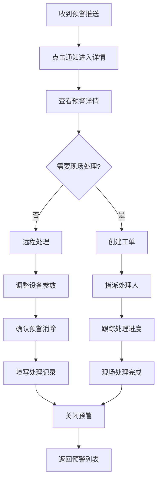
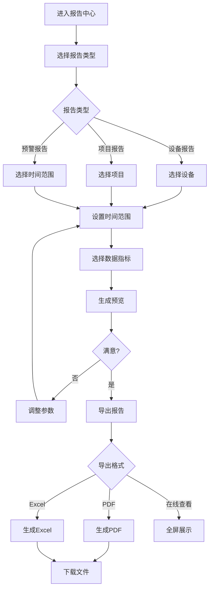

# UX Design Specification - 生命线AI感知云平台

**Author:** rd_agents
**Date:** 2026-03-26

---

<!-- UX design content will be appended sequentially through collaborative workflow steps -->

---

## Executive Summary

### Project Vision

生命线AI感知云平台是一个面向城市生命线基础设施（排水、供水、桥梁、燃气）的智能感知云平台。通过云-边-端三层架构，实现设备快速上线、实时监测、AI预警、数据分析的一体化管理。

**核心差异点：**
- 设备10分钟内完成上电到数据上报
- 边缘AI推理，≤100ms响应
- 等保三级认证 + 信创适配

### Target Users

| 用户角色 | 描述 | 技术水平 | 主要任务 |
|----------|------|----------|----------|
| 管理员 | 政府部门负责人 | 中等 | 全局监控、决策支持、报告审批 |
| 运维员 | 一线运维人员 | 中高 | 设备管理、预警处理、现场响应 |
| 观察员 | 数据分析人员 | 中等 | 数据查看、报告生成、趋势分析 |

**用户使用场景：**
- **办公环境**：固定工位，大屏/双显示器
- **移动场景**：现场巡检，手机/平板
- **应急场景**：预警响应，需快速操作

### Key Design Challenges

| 挑战 | 说明 | 设计考虑 |
|------|------|----------|
| 设备快速上线 | 10分钟内完成设备注册激活 | 极简扫码注册流程 |
| 海量数据可视化 | 389+设备，实时遥测数据 | ECharts图表、虚拟滚动 |
| 实时预警体验 | 预警推送≤5秒 | WebSocket实时更新、醒目提示 |
| 多角色权限 | 3级RBAC | 权限感知UI、功能可见性控制 |
| 政府合规 | 等保三级、信创 | 界面稳重、数据安全提示 |

### Design Opportunities

| 机会 | 潜在价值 | 优先级 |
|------|----------|--------|
| 扫码即用体验 | 核心差异化，降低部署成本 | P0 |
| 预警态势感知 | 一屏掌握全局状态 | P0 |
| 智能预警看板 | 分级预警，快速响应 | P0 |
| 地图可视化 | 设备分布、管网拓扑 | P1 |
| 移动端适配 | 运维人员现场使用 | P1 |

---

## Core User Experience

### Defining Experience

**核心差异化体验：** 设备10分钟内完成扫码注册到数据上报

**最关键的用户动作：**

| 动作 | 频率 | 重要性 | 用户角色 |
|------|------|--------|----------|
| 设备扫码注册 | 高（部署期） | ⭐⭐⭐ 核心 | 运维员 |
| 预警查看与处理 | 高（日常） | ⭐⭐⭐ 核心 | 运维员/管理员 |
| 设备状态监控 | 高（日常） | ⭐⭐ 高 | 所有角色 |
| 数据报告导出 | 中（周期性） | ⭐⭐ 高 | 观察员/管理员 |

### Platform Strategy

| 平台 | 优先级 | 用途 | 技术方案 |
|------|--------|------|----------|
| Web桌面端 | P0 | 日常管理 | Vue Vben Admin 5.x |
| 移动端H5 | P1 | 现场运维 | 响应式适配 |
| 大屏展示 | P2 | 指挥中心 | 独立大屏模块 |

**交互方式：**
- 桌面端：鼠标 + 键盘
- 移动端：触摸
- 大屏：遥控/触控

**离线能力：**
- 移动端支持离线查看已缓存数据
- 边缘设备支持离线AI推理

### Effortless Interactions

**零摩擦体验设计：**

| 交互 | 当前痛点 | 设计目标 |
|------|----------|----------|
| 设备注册 | 传统方式需配置IP、参数 | 扫码即用，自动发现 |
| 预警接收 | 被动刷新页面 | WebSocket实时推送 |
| 设备定位 | 手动记录位置 | 地图自动定位 |
| 数据查询 | 复杂筛选条件 | 智能时间范围 + 设备筛选 |

**自动化体验：**
- 设备上线自动检测
- 预警实时推送（无需刷新）
- 数据自动聚合（物化视图）
- 报告定时生成

### Critical Success Moments

**"这就是我需要的"时刻：**

| 时刻 | 用户感受 | 设计要点 |
|------|----------|----------|
| 设备10分钟上线 | "比以前快多了" | 扫码→激活→数据上报，3步完成 |
| 预警实时弹出 | "第一时间知道" | WebSocket推送 + 声音提醒 |
| 一眼看懂态势 | "全局尽在掌握" | 预警看板 + 地图可视化 |
| 报告一键导出 | "省时省力" | 模板化报告 + PDF导出 |

**失败即毁体验的关键流程：**
1. 设备注册失败（核心差异化功能）
2. 预警延迟或漏报（核心业务价值）
3. 数据查询超时（日常使用频率高）

### Experience Principles

| 原则 | 说明 | 应用场景 |
|------|------|----------|
| **扫码即用** | 设备上线零配置，扫码即可 | 设备注册流程 |
| **实时感知** | 数据变化即时呈现，无需刷新 | 预警、状态监控 |
| **一目了然** | 关键信息一屏呈现，层级清晰 | 仪表盘、看板 |
| **快速响应** | 关键操作≤3步，高频功能触手可及 | 预警处理、设备操作 |
| **安全可信** | 数据安全可视化，操作可追溯 | 权限控制、审计日志 |

---

## Desired Emotional Response

### Primary Emotional Goals

| 情感 | 重要性 | 设计目标 |
|------|--------|----------|
| **信任** | ⭐⭐⭐ 核心 | 数据准确、系统可靠 |
| **掌控感** | ⭐⭐⭐ 核心 | 设备管理、预警响应可控 |
| **自信** | ⭐⭐⭐ 核心 | 操作清晰、不困惑 |
| **高效** | ⭐⭐ 高 | 快速完成任务 |
| **安全** | ⭐⭐ 高 | 系统安全、数据保密 |

**差异化情感：** "终于有一个让我放心的监测平台了"

### Emotional Journey Mapping

| 阶段 | 期望情感 | 避免情感 | 设计要点 |
|------|----------|----------|----------|
| 首次发现 | 专业、可靠 | 怀疑、困惑 | 清晰价值主张、专业视觉 |
| 首次使用 | 惊喜、轻松 | 挫败、迷茫 | 引导流程、清晰导航 |
| 核心操作 | 高效、掌控 | 焦虑、无助 | 简化流程、即时反馈 |
| 完成任务 | 成就、满足 | 疲惫、不满 | 成功确认、进度反馈 |
| 遇到问题 | 支持、理解 | 恐慌、愤怒 | 清晰错误提示、解决路径 |
| 再次使用 | 习惯、依赖 | 抵触、厌倦 | 一致性、效率提升 |

### Micro-Emotions

| 微情感 | 期望状态 | 设计策略 |
|--------|----------|----------|
| 信心 vs 困惑 | ✅ 信心 | 清晰视觉层级、明确操作引导 |
| 信任 vs 怀疑 | ✅ 信任 | 数据透明、操作可追溯 |
| 平静 vs 焦虑 | ✅ 平静 | 预警分级、处理流程清晰 |
| 成就 vs 挫败 | ✅ 成就 | 任务完成反馈、进度可视化 |
| 安全 vs 担忧 | ✅ 安全 | 权限可见、数据加密提示 |

### Design Implications

| 期望情感 | UX设计策略 |
|----------|------------|
| **信任** | 数据来源标注、时间戳、数据准确性指标 |
| **掌控感** | 设备状态一目了然、操作即时反馈 |
| **自信** | 步骤引导、操作提示、帮助文档 |
| **高效** | 关键操作≤3步、快捷入口、批量操作 |
| **安全** | 权限可见、操作日志、敏感数据脱敏 |
| **平静** | 预警分级颜色、处理建议、不惊吓用户 |

### Emotional Design Principles

1. **专业可信** - 界面稳重，数据透明，操作可追溯
2. **简洁高效** - 减少认知负担，关键信息突出
3. **即时反馈** - 每个操作都有明确响应
4. **主动帮助** - 预判用户需求，提供智能建议
5. **情绪安抚** - 预警时提供解决方案，不只是问题

---

## UX Pattern Analysis & Inspiration

### Inspiring Products Analysis

| 产品 | 类型 | 借鉴价值 |
|------|------|----------|
| **Vue Vben Admin** | 企业后台 | 已选定框架，内置最佳实践 |
| **ThingsBoard** | IoT平台 | 设备管理、数据可视化参考 |
| **Grafana** | 监控仪表盘 | 图表、告警模式参考 |
| **阿里云IoT平台** | IoT云服务 | 设备接入流程参考 |
| **华为云控制台** | 云管理平台 | 政府项目风格参考 |

### Transferable UX Patterns

#### 导航模式

| 模式 | 应用场景 |
|------|----------|
| 顶部导航 + 侧边菜单 | 全局导航结构 |
| 面包屑导航 | 深层级页面定位 |
| 标签页缓存 | 多页面切换保留状态 |
| 快捷搜索 | 全局设备/项目搜索 |

#### 数据展示模式

| 模式 | 应用场景 |
|------|----------|
| 卡片式统计 | 仪表盘关键指标 |
| 实时图表 | 遥测数据可视化 |
| 状态徽章 | 设备在线/离线/告警 |
| 虚拟滚动表格 | 大数据量设备列表 |
| 时间范围选择器 | 数据查询筛选 |

#### 交互模式

| 模式 | 应用场景 |
|------|----------|
| 扫码输入 | 设备注册 |
| 实时推送通知 | 预警通知 |
| 批量操作 | 设备批量管理 |
| 操作确认弹窗 | 敏感操作确认 |
| 加载骨架屏 | 数据加载状态 |

#### 视觉模式

| 模式 | 应用场景 |
|------|----------|
| 政府蓝主题 (#0050b3) | 整体配色 |
| 预警分级颜色 | 红/橙/黄/蓝 |
| 数据卡片阴影 | 信息层级区分 |
| 图标+文字 | 操作按钮 |

### Anti-Patterns to Avoid

| 反模式 | 问题 | 正确做法 |
|--------|------|----------|
| 过度动画 | 政府用户偏好稳重 | 简洁过渡，无花哨动效 |
| 信息过载 | 一屏显示过多数据 | 分层展示，渐进披露 |
| 隐藏关键操作 | 用户找不到功能 | 高频操作明显可见 |
| 模态框嵌套 | 操作流程混乱 | 单层模态，流程清晰 |
| 自动刷新全页 | 丢失用户状态 | 局部刷新，保留位置 |
| 模糊错误提示 | 用户不知如何处理 | 具体错误 + 解决建议 |

### Design Inspiration Strategy

#### 采纳

| 模式 | 来源 | 原因 |
|------|------|------|
| Vue Vben Admin布局 | Vue Vben Admin | 框架内置，成熟稳定 |
| 预警分级颜色体系 | Grafana | 行业标准，用户熟悉 |
| 实时数据推送 | 协作工具 | 核心体验需求 |
| 扫码注册流程 | 移动应用 | 核心差异化功能 |

#### 适配

| 模式 | 原始 | 适配方向 |
|------|------|----------|
| 图表组件 | Grafana | 简化配置，预设模板 |
| 设备列表 | IoT平台 | 增加状态筛选、批量操作 |
| 预警看板 | 监控系统 | 增加处理流程、责任人 |
| 地图展示 | 通用地图 | 集成天地图，设备图层 |

#### 避免

| 模式 | 原因 |
|------|------|
| 复杂配置项 | 用户技术水平中等 |
| 深层级嵌套 | 政府用户偏好简单 |
| 花哨动效 | 不符合政府项目风格 |

---

## Design System Foundation

### Design System Choice

**已选定：Vue Vben Admin 5.x + Ant Design Vue**

| 组件 | 选型 | 版本 | 说明 |
|------|------|------|------|
| 前端框架 | Vue Vben Admin | 5.x | 企业级解决方案 |
| UI组件库 | Ant Design Vue | 4.x | 与Vben深度集成 |
| 图表库 | ECharts | 5.x | IoT数据可视化 |
| 地图组件 | 天地图 | - | 政府项目合规 |
| 图标库 | @iconify | - | 丰富图标资源 |

### Rationale for Selection

| 因素 | 分析 | 结论 |
|------|------|------|
| 开发效率 | 开箱即用的企业级组件 | ✅ 高效 |
| 政府风格 | 可定制主题色为政府蓝 | ✅ 符合 |
| 功能完整 | 权限、多标签、主题切换内置 | ✅ 完整 |
| 技术栈 | Vue3 + Vite + TypeScript | ✅ 统一 |
| 社区支持 | 活跃的中文社区 | ✅ 友好 |
| 信创适配 | 可迁移至国产浏览器 | ✅ 支持 |

### Design Tokens

#### 品牌色

| 令牌 | CSS变量 | 值 | 用途 |
|------|---------|-----|------|
| 主色 | `--primary-color` | #0050b3 | 主色调（政府蓝） |
| 主色悬停 | `--primary-color-hover` | #003d8f | 主色悬停态 |
| 主色激活 | `--primary-color-active` | #002766 | 主色激活态 |
| 成功色 | `--success-color` | #52c41a | 成功状态 |
| 警告色 | `--warning-color` | #faad14 | 警告状态 |
| 错误色 | `--error-color` | #ff4d4f | 错误/严重预警 |
| 信息色 | `--info-color` | #1890ff | 信息提示 |

#### 预警分级色

| 级别 | 颜色 | 色值 | 用途 |
|------|------|------|------|
| 特别严重 | 红色 | #ff4d4f | 紧急预警，需立即响应 |
| 严重 | 橙色 | #fa8c16 | 高级预警，优先处理 |
| 较重 | 黄色 | #fadb14 | 中级预警，及时关注 |
| 一般 | 蓝色 | #1890ff | 低级预警，日常关注 |

#### 设备状态色

| 状态 | 颜色 | 色值 | 用途 |
|------|------|------|------|
| 在线 | 绿色 | #52c41a | 设备正常运行 |
| 离线 | 灰色 | #8c8c8c | 设备断开连接 |
| 告警 | 红色 | #ff4d4f | 设备异常告警 |
| 维护 | 黄色 | #faad14 | 设备维护中 |

#### 中性色

| 令牌 | 色值 | 用途 |
|------|------|------|
| 标题色 | #262626 | 一级标题 |
| 正文色 | #595959 | 正文内容 |
| 次要色 | #8c8c8c | 辅助信息 |
| 禁用色 | #bfbfbf | 禁用状态 |
| 边框色 | #d9d9d9 | 分割线、边框 |
| 背景色 | #f5f5f5 | 页面背景 |

### Implementation Approach

| 阶段 | 任务 | 说明 |
|------|------|------|
| 1. 初始化 | 克隆Vue Vben Admin模板 | `pnpm create vben` |
| 2. 主题定制 | 修改设计令牌 | 政府蓝主题 |
| 3. 布局调整 | 配置侧边菜单、顶部导航 | 按业务需求 |
| 4. 组件扩展 | 开发定制组件 | 设备卡片、预警卡片等 |
| 5. 图表集成 | 配置ECharts | 预设图表模板 |
| 6. 地图集成 | 集成天地图API | 设备分布地图 |

### Customization Strategy

#### 需要定制的组件

| 组件 | 基于 | 定制内容 |
|------|------|----------|
| DeviceCard | Ant Design Card | 设备状态、位置、最新数据 |
| AlertCard | Ant Design Card | 预警级别、时间、处理状态 |
| DeviceStatusBadge | Ant Design Badge | 在线/离线/告警状态 |
| TelemetryChart | ECharts | 实时数据曲线图 |
| DeviceMap | 天地图API | 设备分布地图 |
| AlertLevelTag | Ant Design Tag | 预警级别标签 |

#### 保持标准的组件

- 表单组件（Input、Select、DatePicker等）
- 弹窗组件（Modal、Drawer）
- 分页组件（Pagination）
- 树形选择器（TreeSelect）
- 上传组件（Upload）
- 消息提示（Message、Notification）

---

## Core Experience Definition

### Defining Experience

**"扫码即用，10分钟设备上线"**

这是用户会向同事描述的核心功能：
> "只需要扫一下二维码，设备就能自动上线，10分钟内数据就传上来了"

**为什么这是决定性体验？**

| 对比项 | 传统方式 | 我们的方案 |
|--------|----------|------------|
| 步骤数 | 5+ 步 | 3 步 |
| 时间 | 数小时 | ≤10分钟 |
| 专业知识 | 需要网络配置知识 | 零门槛 |
| 出错率 | 高 | 低 |

### User Mental Model

**用户当前如何解决：**

| 步骤 | 传统方式 | 痛点 |
|------|----------|------|
| 1 | 记录设备序列号 | 容易出错 |
| 2 | 手动配置IP地址 | 需要网络知识 |
| 3 | 登录平台添加设备 | 流程繁琐 |
| 4 | 配置设备参数 | 需要专业知识 |
| 5 | 测试数据上报 | 反复调试 |

**用户期望：**
- "能不能像手机扫码连WiFi一样简单？"
- "设备到货后，插上电就能用"
- "不需要懂网络配置"

**可能困惑点：**
- 扫码后设备没有响应（网络问题）
- 不知道扫哪个码（二维码位置）
- 不确定设备是否成功上线（反馈不及时）

### Success Criteria

| 指标 | 目标 | 衡量方式 |
|------|------|----------|
| 上线时间 | ≤10分钟 | 从扫码到数据上报 |
| 操作步骤 | ≤3步 | 扫码→激活→确认 |
| 成功率 | ≥95% | 首次尝试成功 |
| 用户满意度 | "这也太简单了" | 用户反馈 |

**"这就对了"的时刻：**
1. 扫码后立即看到设备预览信息
2. 点击"激活"后进度条实时显示
3. 数据上报成功后自动跳转到设备详情

### Experience Mechanics

#### Step 1: 扫码

```
用户操作：打开APP → 点击"添加设备" → 扫描设备二维码
系统响应：识别二维码 → 获取设备预注册信息 → 显示设备预览
```

**设备预览信息：**
- 设备型号
- 所属项目
- 安装位置
- 设备状态（待激活）

#### Step 2: 激活

```
用户操作：确认设备信息 → 点击"激活设备"
系统响应：发送激活指令 → 显示激活进度
```

**激活进度可视化：**
- ▶ 网络连接中... ✓
- ▶ 服务器注册中... ✓
- ▶ 数据上报中... ⏳

#### Step 3: 完成

```
系统响应：显示成功提示 → 自动跳转设备详情
用户操作：查看设备详情 / 继续添加设备
```

**成功提示内容：**
- 🎉 设备上线成功！
- 设备编号: D-2026-0001
- 首条数据已上报: 2026-03-26 10:30:00

### Error Handling

| 错误场景 | 处理方式 | 用户操作 |
|----------|----------|----------|
| 设备已激活 | 提示"设备已在项目中"，显示设备信息 | 查看设备详情 |
| 网络超时 | 显示重试按钮，保留已填信息 | 点击重试 |
| 二维码无效 | 提示"请扫描正确的设备二维码" | 重新扫描 |
| 项目配额满 | 提示"已达到项目设备上限，请联系管理员" | 联系管理员 |
| 权限不足 | 提示"您没有添加设备的权限" | 联系管理员 |

---

## Visual Design Foundation

### Color System

#### 品牌色板

| 色彩角色 | CSS变量 | 色值 | 用途 |
|----------|---------|------|------|
| 主色 | `--primary-color` | #0050b3 | 品牌主色，主要按钮、链接 |
| 主色浅 | `--primary-color-hover` | #1890ff | 悬停态、次级强调 |
| 主色深 | `--primary-color-active` | #003d8f | 激活态、强调 |

#### 语义色

| 语义 | 色值 | 用途 |
|------|------|------|
| 成功 | #52c41a | 成功状态、在线设备 |
| 警告 | #faad14 | 警告状态、维护中 |
| 错误 | #ff4d4f | 错误状态、严重告警 |
| 信息 | #1890ff | 信息提示 |

#### 预警分级色

| 级别 | 颜色 | 色值 | 用途 |
|------|------|------|------|
| 特别严重（红） | 红色 | #ff4d4f | 紧急预警，需立即响应 |
| 严重（橙） | 橙色 | #fa8c16 | 高级预警，优先处理 |
| 较重（黄） | 黄色 | #fadb14 | 中级预警，及时关注 |
| 一般（蓝） | 蓝色 | #1890ff | 低级预警，日常关注 |

#### 设备状态色

| 状态 | 颜色 | 色值 | 用途 |
|------|------|------|------|
| 在线 | 绿色 | #52c41a | 设备正常运行 |
| 离线 | 灰色 | #8c8c8c | 设备断开连接 |
| 告警 | 红色 | #ff4d4f | 设备异常告警 |
| 维护 | 黄色 | #faad14 | 设备维护中 |

### Typography System

#### 字体选择

| 类型 | 字体 | 备选 | 用途 |
|------|------|------|------|
| 主字体 | -apple-system, BlinkMacSystemFont | "PingFang SC" | 正文 |
| 中文字体 | "PingFang SC", "Microsoft YaHei" | sans-serif | 中文标题 |
| 等宽字体 | "SF Mono", "SFMono-Regular" | Consolas, monospace | 代码、数据 |

#### 字号阶梯

| 级别 | 字号 | 行高 | 字重 | 用途 |
|------|------|------|------|------|
| H1 | 28px | 1.4 | 600 | 页面标题 |
| H2 | 24px | 1.4 | 600 | 区块标题 |
| H3 | 20px | 1.5 | 500 | 卡片标题 |
| H4 | 16px | 1.5 | 500 | 小标题 |
| Body | 14px | 1.5 | 400 | 正文 |
| Small | 12px | 1.5 | 400 | 辅助文字 |

### Spacing & Layout Foundation

#### 间距系统

基于 8px 网格系统：

| 令牌 | 值 | 用途 |
|------|-----|------|
| `--spacing-xs` | 4px | 紧凑间距 |
| `--spacing-sm` | 8px | 元素内间距 |
| `--spacing-md` | 16px | 组件间距 |
| `--spacing-lg` | 24px | 区块间距 |
| `--spacing-xl` | 32px | 大区块间距 |
| `--spacing-xxl` | 48px | 页面级间距 |

#### 布局参数

| 参数 | 值 | 说明 |
|------|-----|------|
| 内容区最大宽度 | 1200px | 居中显示 |
| 侧边栏宽度 | 200px | 可折叠为 80px |
| 卡片圆角 | 8px | 标准圆角 |
| 按钮圆角 | 4px | 小圆角 |
| 阴影层级 | 0/1/2/3 | 四级阴影深度 |

### Accessibility Considerations

#### 对比度要求

| 场景 | 最小对比度 | 标准 |
|------|------------|------|
| 正文文字 | 4.5:1 | WCAG AA |
| 大号文字（≥18px） | 3:1 | WCAG AA |
| 图标/图形元素 | 3:1 | WCAG AA |

#### 可访问性设计要点

- 所有交互元素支持键盘导航（Tab/Enter/Escape）
- 焦点状态清晰可见（2px outline）
- 色彩不是唯一信息传达方式（配合图标/文字）
- 图标配合文字说明
- 表单标签明确关联
- 错误提示提供解决建议

---

## Design Direction Decision

### Design Directions Explored

| 方向 | 特点 | 适用场景 | 优势 | 劣势 |
|------|------|----------|------|------|
| **A: 数据仪表盘型** | 多卡片布局，信息密度高 | 全局监控、数据分析 | 信息全面，一目了然 | 信息过载风险 |
| **B: 预警中心型** | 预警卡片醒目，快速响应 | 预警处理、应急响应 | 预警突出，响应快速 | 缺少全局视角 |
| **C: 地图主导型** | 设备分布可视化，空间感知 | 区域管理、巡检规划 | 地理信息直观 | 非空间数据展示弱 |
| **D: 简洁高效型** | 表格为主，操作导向 | 高频操作、日常运维 | 操作效率高 | 缺少视觉层次 |

### Chosen Direction

**选定方向：A + B 混合型（数据仪表盘 + 预警中心）**

**核心理念：** 全局态势感知 + 预警快速响应

### Design Rationale

| 决策点 | 选择 | 理由 |
|--------|------|------|
| 布局类型 | 混合仪表盘 | 满足多角色需求，全局感知+快速响应 |
| 信息优先级 | 预警 > 状态 > 趋势 > 地图 | 预警是核心业务，需要第一时间关注 |
| 导航结构 | 侧边栏+顶部导航 | Vue Vben Admin标准布局，用户熟悉 |
| 数据展示 | 卡片+图表+列表 | 多维度展示，满足不同场景 |
| 响应式 | 渐进简化 | 保持核心功能，逐步简化布局 |

### Dashboard Layout Structure

```
┌─────────────────────────────────────────────────────────────────────────┐
│ 顶部导航栏（Logo + 全局搜索 + 消息中心 + 用户信息）                        │
├──────────┬──────────────────────────────────────────────────────────────┤
│          │ ┌─────────────┬─────────────┬─────────────┬─────────────┐    │
│          │ │ 🔴 严重预警  │ 🟠 较重预警  │ 🟡 一般预警  │ 📊 今日总数  │    │
│          │ │    12      │     28      │     45      │     85     │    │
│          │ └─────────────┴─────────────┴─────────────┴─────────────┘    │
│  侧边栏   ├──────────────────────────────────────────────────────────────┤
│  导航     │ ┌─────────────┬─────────────┬─────────────┬─────────────┐    │
│  菜单     │ │ 🟢 在线设备  │ ⚫ 离线设备  │ 🔴 告警设备  │ 📈 设备总数  │    │
│          │ │    356     │     21      │     12      │     389     │    │
│          │ └─────────────┴─────────────┴─────────────┴─────────────┘    │
│          ├─────────────────────────────┬────────────────────────────────┤
│          │                             │                                │
│          │    📋 实时预警列表            │      🗺️ 设备分布地图           │
│          │    （最近10条，实时滚动）      │      （天地图 + 设备标记）      │
│          │                             │                                │
│          ├─────────────────────────────┴────────────────────────────────┤
│          │                     📈 数据趋势图                              │
│          │                  （ECharts 时序图）                            │
└──────────┴──────────────────────────────────────────────────────────────┘
```

### Implementation Approach

#### 基础框架
- **模板来源：** Vue Vben Admin 5.x Dashboard
- **布局组件：** 使用框架内置的 BasicLayout

#### 定制组件清单

| 组件名 | 基于 | 功能 |
|--------|------|------|
| AlertSummaryCard | Ant Design Card | 4级预警统计卡片 |
| DeviceStatusCard | Ant Design Card | 设备状态统计卡片 |
| RealTimeAlertList | Ant Design List | 实时预警滚动列表 |
| DeviceMapCard | 天地图API | 设备分布地图 |
| TelemetryChart | ECharts | 数据趋势时序图 |

#### 响应式断点

| 断点 | 宽度 | 布局调整 |
|------|------|----------|
| 桌面端 | ≥1200px | 4列统计卡片 + 2列主内容 |
| 小桌面 | 992-1199px | 2列统计卡片 + 2列主内容 |
| 平板端 | 768-991px | 2列统计卡片 + 1列主内容 |
| 移动端 | <768px | 单列堆叠布局 |

---

## User Journey Flows

基于PRD中定义的4个用户旅程，设计详细的交互流程。

### Journey 1: 设备快速上线（运维员）

**目标：** 10分钟内完成设备扫码注册到数据上报

```mermaid
flowchart TD
    A[打开移动端APP] --> B[点击"添加设备"]
    B --> C[扫描设备二维码]
    C --> D{二维码有效?}
    D -->|否| E[提示"请扫描正确的设备二维码"]
    E --> C
    D -->|是| F[显示设备预览信息]
    F --> G{设备已激活?}
    G -->|是| H[提示"设备已在项目中"]
    H --> I[查看设备详情]
    G -->|否| J[确认设备信息]
    J --> K[点击"激活设备"]
    K --> L[显示激活进度]
    L --> M{网络连接}
    M -->|失败| N[显示重试按钮]
    N --> K
    M -->|成功| O{服务器注册}
    O -->|失败| P[显示错误+解决建议]
    O -->|成功| Q{数据上报}
    Q -->|失败| R[显示等待提示]
    R --> Q
    Q -->|成功| S[显示成功提示]
    S --> T[自动跳转设备详情]
```

**关键交互点：**

| 步骤 | 用户操作 | 系统响应 | 反馈方式 |
|------|----------|----------|----------|
| 扫码 | 对准二维码 | 识别并解析 | 震动+声音 |
| 激活 | 点击按钮 | 显示进度条 | 进度动画 |
| 完成 | 等待结果 | 显示成功页 | 成功动画 |

**错误处理：**

| 错误 | 处理 | 恢复路径 |
|------|------|----------|
| 二维码无效 | 友好提示 | 重新扫描 |
| 网络超时 | 重试按钮 | 重新激活 |
| 设备已激活 | 显示信息 | 查看详情 |
| 权限不足 | 提示联系管理员 | 返回首页 |

### Journey 2: 实时预警处理（运维员）

**目标：** 收到预警后快速响应并处理



**关键交互点：**

| 步骤 | 用户操作 | 系统响应 | 反馈方式 |
|------|----------|----------|----------|
| 推送 | 无操作 | 声音+震动+通知 | 预警级别声音 |
| 详情 | 查看信息 | 展示完整上下文 | 设备位置+历史 |
| 处理 | 选择方式 | 提供操作入口 | 按钮/表单 |
| 关闭 | 确认处理 | 记录处理信息 | 成功提示 |

### Journey 3: 预警规则配置（管理员）

**目标：** 配置项目级预警规则和响应流程

```mermaid
flowchart TD
    A[进入预警规则管理] --> B[选择项目]
    B --> C[查看现有规则列表]
    C --> D{操作类型}
    D -->|新增| E[点击"新建规则"]
    D -->|编辑| F[选择规则编辑]
    D -->|删除| G[确认删除]
    E --> H[选择设备类型]
    H --> I[选择指标]
    I --> J[设置阈值条件]
    J --> K[选择预警级别]
    K --> L[配置通知方式]
    L --> M[设置响应人]
    M --> N[预览规则效果]
    N --> O{确认保存?}
    O -->|否| P[返回修改]
    O -->|是| Q[保存规则]
    Q --> R[规则生效]
    F --> H
    G --> C
```

**关键交互点：**

| 步骤 | 用户操作 | 系统响应 | 反馈方式 |
|------|----------|----------|----------|
| 选择指标 | 下拉选择 | 显示可用指标 | 分类展示 |
| 设置阈值 | 输入数值 | 实时校验 | 错误提示 |
| 预览效果 | 点击预览 | 模拟触发效果 | 可视化展示 |
| 保存 | 确认保存 | 验证并保存 | 成功提示 |

### Journey 4: 数据报告查看（观察员/管理员）

**目标：** 查看历史数据和生成报告



**关键交互点：**

| 步骤 | 用户操作 | 系统响应 | 反馈方式 |
|------|----------|----------|----------|
| 选择类型 | 点击选项 | 展开详细配置 | 面包屑导航 |
| 设置时间 | 日期选择 | 快捷选项 | 预设范围 |
| 生成预览 | 点击生成 | 显示加载状态 | 进度条 |
| 导出 | 选择格式 | 生成文件 | 下载提示 |

### Journey Patterns

#### 导航模式

| 模式 | 说明 | 应用场景 |
|------|------|----------|
| 侧边栏导航 | 固定侧边栏，可折叠 | 主要功能切换 |
| 面包屑导航 | 显示当前位置层级 | 深层级页面 |
| 标签页缓存 | 多页面并行操作 | 高频切换场景 |
| 返回按钮 | 便捷返回上级 | 详情页/编辑页 |

#### 决策模式

| 模式 | 说明 | 应用场景 |
|------|------|----------|
| 确认对话框 | 重要操作二次确认 | 删除、关闭预警 |
| 选择面板 | 多选项场景 | 设备类型、指标选择 |
| 条件分支 | 根据状态显示不同选项 | 预警处理方式 |

#### 反馈模式

| 模式 | 说明 | 应用场景 |
|------|------|----------|
| Toast提示 | 轻量级操作反馈 | 保存成功、复制成功 |
| 进度条 | 长时间任务反馈 | 激活设备、生成报告 |
| 成功动画 | 关键任务完成 | 设备上线、预警关闭 |
| 错误提示 | 具体错误+解决建议 | 操作失败场景 |

### Flow Optimization Principles

1. **最小化步骤：** 关键操作≤3步完成
2. **即时反馈：** 每个操作都有明确的视觉响应
3. **渐进披露：** 复杂功能分层展示，避免信息过载
4. **错误容忍：** 提供重试、撤销、恢复机制
5. **状态可见：** 用户始终知道当前状态和下一步
6. **一致性：** 相同操作在不同场景下表现一致

---

## Component Strategy

### Design System Components

#### 基础组件（来自Ant Design Vue）

| 类别 | 使用组件 | 用途 |
|------|----------|------|
| 按钮 | Button | 操作触发、表单提交 |
| 图标 | Icon | 状态指示、操作提示 |
| 表单 | Form, Input, Select | 数据录入、筛选 |
| 表格 | Table | 设备列表、预警列表 |
| 卡片 | Card | 信息容器 |
| 标签 | Tag | 状态标记、分类 |
| 徽章 | Badge | 数量提示、状态点 |
| 弹窗 | Modal | 操作确认、详情展示 |
| 消息 | Message, Notification | 操作反馈、预警推送 |
| 分页 | Pagination | 列表分页 |
| 日期 | DatePicker | 时间范围选择 |

#### 高级组件（来自Vue Vben Admin）

| 组件 | 用途 |
|------|------|
| BasicTable | 设备管理、预警管理列表 |
| BasicForm | 高级搜索、设备配置 |
| BasicModal | 设备详情、预警处理 |
| Description | 设备详情展示 |

### Custom Components

#### DeviceCard 设备卡片

**用途：** 展示单个设备的关键信息和状态

**结构设计：**

```
┌─────────────────────────────────────┐
│ 🟢 设备编号: D-2026-0001        [⋯] │
├─────────────────────────────────────┤
│ 设备类型: 水位计                      │
│ 安装位置: 1号排水口                   │
│ 最新数据: 水位 2.35m (10:30:00)       │
├─────────────────────────────────────┤
│ 上线时间: 2026-03-25 09:00           │
└─────────────────────────────────────┘
```

**Props定义：**

| 属性 | 类型 | 必填 | 说明 |
|------|------|------|------|
| deviceId | string | 是 | 设备编号 |
| deviceType | string | 是 | 设备类型 |
| status | enum | 是 | 在线/离线/告警/维护 |
| location | string | 是 | 安装位置 |
| latestData | object | 否 | 最新遥测数据 |
| onlineTime | string | 否 | 上线时间 |

**状态样式：**

| 状态 | 徽章颜色 | 边框 |
|------|----------|------|
| 在线 | 绿色 | 无 |
| 离线 | 灰色 | 无 |
| 告警 | 红色 | 红色左边框 |
| 维护 | 黄色 | 无 |

#### AlertCard 预警卡片

**用途：** 展示预警信息和处理入口

**结构设计：**

```
┌─────────────────────────────────────┐
│ 🔴 严重预警                          │
│ 设备: D-2026-0001                    │
│ 内容: 水位超过警戒值 3.5m             │
│ 时间: 2026-03-26 10:30:00            │
├─────────────────────────────────────┤
│ [查看详情]        [立即处理]          │
└─────────────────────────────────────┘
```

**Props定义：**

| 属性 | 类型 | 必填 | 说明 |
|------|------|------|------|
| alertId | string | 是 | 预警编号 |
| level | enum | 是 | 预警级别 |
| deviceId | string | 是 | 设备编号 |
| content | string | 是 | 预警内容 |
| time | string | 是 | 发生时间 |
| status | enum | 是 | 待处理/处理中/已处理 |

**状态样式：**

| 状态 | 背景色 | 边框 |
|------|--------|------|
| 待处理 | 白色 | 对应级别左边框 |
| 处理中 | 蓝色淡 | 蓝色边框 |
| 已处理 | 绿色淡 | 无 |
| 已关闭 | 灰色淡 | 无 |

#### AlertSummaryCard 预警统计卡片

**用途：** 展示各级别预警数量

**结构设计：**

```
┌───────────────────┐
│ 🔴 严重预警        │
│       12          │
│   较昨日 +3       │
└───────────────────┘
```

**Props定义：**

| 属性 | 类型 | 必填 | 说明 |
|------|------|------|------|
| level | enum | 是 | 预警级别 |
| count | number | 是 | 当前数量 |
| trend | number | 否 | 较昨日变化 |
| onClick | func | 否 | 点击回调 |

**交互：**
- 点击跳转到对应级别预警列表
- 悬停显示详细说明

#### DeviceStatusCard 设备状态卡片

**用途：** 展示设备在线/离线/告警统计

**结构设计：**

```
┌─────────────────────────────────────┐
│ 📊 设备状态统计                       │
├───────┬───────┬───────┬─────────────┤
│ 🟢    │ ⚫    │ 🔴    │ 📈          │
│ 在线  │ 离线  │ 告警  │ 总数        │
│ 356   │ 21    │ 12    │ 389         │
└───────┴───────┴───────┴─────────────┘
```

#### AlertLevelTag 预警级别标签

**用途：** 显示预警级别

| 级别 | 颜色 | 文字 | 色值 |
|------|------|------|------|
| 特别严重 | 红色 | 特别严重 | #ff4d4f |
| 严重 | 橙色 | 严重 | #fa8c16 |
| 较重 | 黄色 | 较重 | #fadb14 |
| 一般 | 蓝色 | 一般 | #1890ff |

#### DeviceStatusBadge 设备状态徽章

**用途：** 设备状态快速标识

| 状态 | 图标 | 颜色 | 文字 |
|------|------|------|------|
| 在线 | ● | 绿色 | 在线 |
| 离线 | ● | 灰色 | 离线 |
| 告警 | ● | 红色 | 告警 |
| 维护 | ● | 黄色 | 维护 |

### Component Implementation Strategy

#### 开发原则

1. **复用优先：** 优先使用Ant Design Vue原生组件
2. **组合封装：** 通过组合原生组件创建业务组件
3. **类型安全：** 所有组件使用TypeScript定义props
4. **可访问性：** 遵循WCAG 2.1 AA标准
5. **一致性：** 使用统一的设计令牌

#### 技术实现

| 组件类型 | 实现方式 | 示例 |
|----------|----------|------|
| 基础封装 | 扩展Ant Design组件 | DeviceCard extends Card |
| 组合组件 | 组合多个基础组件 | AlertSummaryCard |
| 图表组件 | 封装ECharts | TelemetryChart |
| 地图组件 | 封装天地图API | DeviceMapCard |

### Implementation Roadmap

#### Phase 1 - 核心组件（P0）

| 组件 | 依赖 | 用于 | 优先级 |
|------|------|------|--------|
| AlertLevelTag | Ant Design Tag | 预警列表、详情 | P0 |
| DeviceStatusBadge | Ant Design Badge | 设备列表、详情 | P0 |
| AlertSummaryCard | Ant Design Card | 仪表盘 | P0 |
| DeviceStatusCard | Ant Design Card | 仪表盘 | P0 |
| DeviceCard | Ant Design Card | 设备列表 | P0 |
| AlertCard | Ant Design Card | 预警列表 | P0 |

#### Phase 2 - 数据可视化（P1）

| 组件 | 依赖 | 用于 | 优先级 |
|------|------|------|--------|
| TelemetryChart | ECharts | 数据详情页 | P1 |
| DeviceMapCard | 天地图API | 仪表盘、地图页 | P1 |

#### Phase 3 - 增强组件（P2）

| 组件 | 依赖 | 用于 | 优先级 |
|------|------|------|--------|
| ReportPreview | Ant Design Modal | 报告预览 | P2 |
| ExportButton | Ant Design Button | 报告导出 | P2 |
